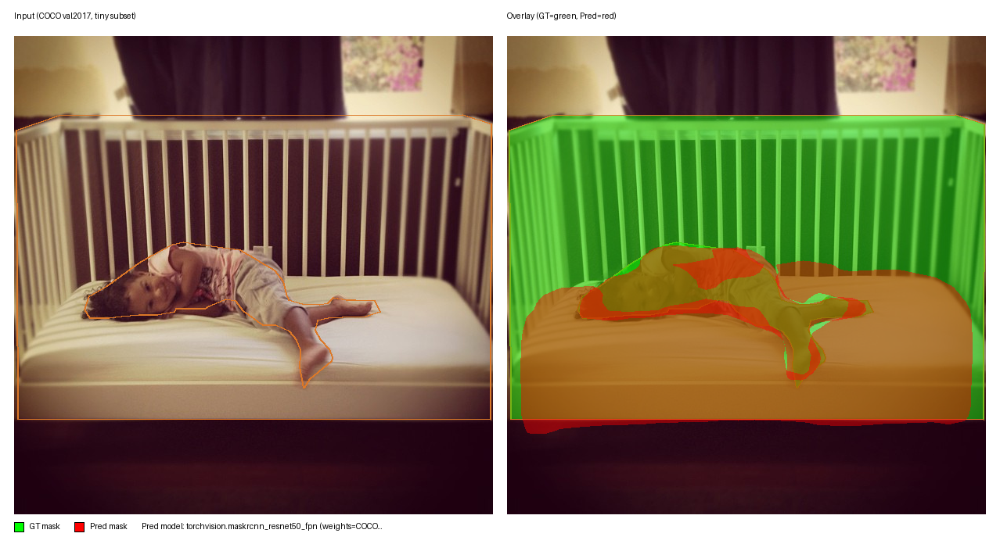
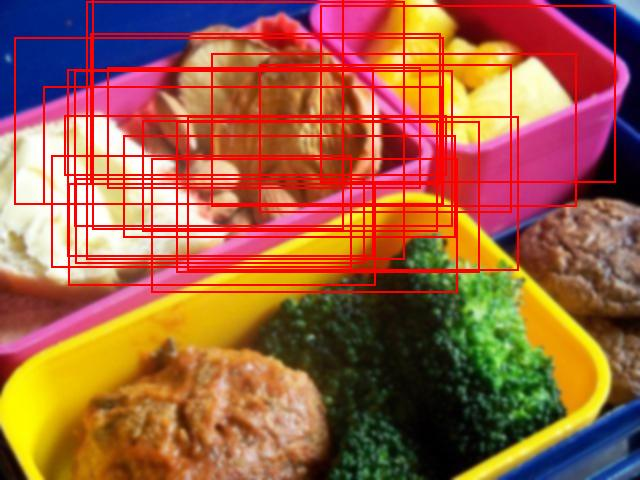
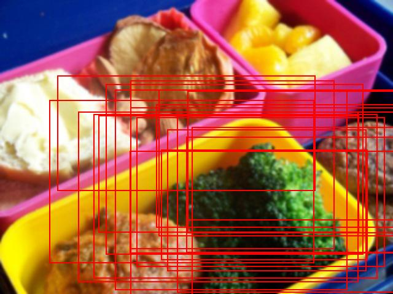

# YOLOZU (萬)

Japanese: [`Readme_jp.md`](Readme_jp.md)

[](https://pypi.org/project/yolozu/)
[](https://github.com/ToppyMicroServices/YOLOZU/releases/latest)
[](https://doi.org/10.5281/zenodo.18744756)
[](https://doi.org/10.5281/zenodo.18744926)
[](https://pypi.org/project/yolozu/)
[](LICENSE)
[](https://github.com/ToppyMicroServices/YOLOZU/actions/workflows/build_and_test.yml)
[](https://github.com/ToppyMicroServices/YOLOZU/actions/workflows/container.yml)
[-0A7A0A)](https://github.com/ToppyMicroServices/YOLOZU/actions/workflows/build_and_test.yml)
[](https://github.com/ToppyMicroServices/YOLOZU/actions/workflows/container.yml)


## 30-second Quick Win (pip)

**Predictions-first interface contract.** Export `predictions.json` once, then validate + evaluate apples-to-apples across frameworks/backends.

```bash
python3 -m pip install -U yolozu
yolozu demo overview
```

Writes: `demo_output/overview/<utc>/demo_overview_report.json`

If YOLOZU saved you time, please star to help others find it.

## YOLOZU at a glance

- **Framework-agnostic evaluation toolkit for vision models**: designed for reproducible continual learning and test-time adaptation under domain shift.
- **Training-capable workflows for mitigating catastrophic forgetting**: supports training and evaluation workflows based on self-distillation, replay, and parameter-efficient updates (PEFT). These approaches reduce forgetting and make it measurable and comparable across runs, though complete elimination is not guaranteed.
- **Support for inference-time adaptation (TTT)**: allows model parameters to be adjusted during inference, enabling continual adaptation to domain shift in deployment.
- **Predictions as the stable interface contract**: treats predictions---not models---as the primary contract, making training, continual learning, and inference-time adaptation comparable, restartable, and CI-friendly across frameworks and runtimes.
- **Multi-task evaluation support**: covers object detection, segmentation, keypoint estimation, monocular depth estimation, and 6DoF pose estimation. Training implementations remain configurable and decoupled, rather than fixed to a specific framework.
- **Production-ready deployment path**: supports ONNX/ExecuTorch export and execution across PyTorch, ONNX Runtime, TensorRT, and ExecuTorch, with reference inference templates in C++ and Rust.
- **Interface-contract-first, AI-first workflow**: every experiment emits versioned artifacts that can be automatically compared and regression-tested in CI.


## Framework Comparison (Same Dataset + Predictions Interface Contract)

One-screen view of how YOLOZU lets you compare different model stacks using the **same dataset** and a stable **predictions interface contract** (`predictions.json` + `export_settings`).

| Model / stack | Fine-tune entrypoint (smoke) | `predictions.json` export path | Eval path | Notes |
| --- | --- | --- | --- | --- |
| Ultralytics YOLO (YOLOv8/YOLO11) | `tools/run_external_finetune_smoke.py` (framework=`yolov`) | `tools/export_predictions_ultralytics.py` | `tools/eval_coco.py` | Typical exports are post-NMS; use `protocol=nms_applied`. |
| RT-DETR (in-repo `rtdetr_pose`) | `tools/run_external_finetune_smoke.py` (framework=`rtdetr`) | `tools/run_reference_adapter_regression.py` (predict→canonicalize) | `tools/run_reference_adapter_regression.py` (gates) | Reference adapter regression is the “real model baseline” path. |
| Hugging Face DETR / RT-DETR | `tools/support_ultralytics_detr.py th` (dry/non-dry) | `tools/support_ultralytics_detr.py pn` (normalize) | `tools/eval_coco.py` | Keeps framework specifics outside the stable interface contract. |
| Detectron2 | `tools/run_external_finetune_smoke.py` (framework=`detectron2`) | `tools/export_predictions_detectron2.py` | `tools/eval_coco.py` | Non-dry execution requires `--detectron2-train-script`. |
| MMDetection | `tools/run_external_finetune_smoke.py` (framework=`mmdetection`) | `tools/export_predictions_mmdet.py` | `tools/eval_coco.py` | Non-dry execution requires `--mmdet-train-script`. |
| YOLOX | (interop smoke) | `tools/yolozu.py export --backend yolox` | `tools/eval_coco.py` | Intended for “external inference → interface contract → eval” workflows. |

Same dataset + same `predictions.json` predictions interface contract means apples-to-apples evaluation across frameworks/backends.

Minimal proof (same dataset, same report shape; safe default is dry-run):

```bash
python3 tools/run_external_finetune_smoke.py --dataset-root data/smoke --split train --output reports/external_finetune_smoke.json
```

Visual evidence (example overlays produced by the instance-seg demo):




## Quickstart (repo checkout, run this first)

```bash
python3 -m pip install -e .
bash scripts/smoke.sh
```

Details (what changed): see [GitHub Release notes](https://github.com/ToppyMicroServices/YOLOZU/releases).

If your system Python is externally managed (PEP 668), use a venv:

```bash
python3 -m venv .venv
source .venv/bin/activate
python -m pip install -U pip
python -m pip install -e .
bash scripts/smoke.sh
```

Output artifacts:
- `reports/smoke_coco_eval_dry_run.json`
- `reports/smoke_synthgen_summary.json`
- `reports/smoke_synthgen_eval.json`
- `reports/smoke_synthgen_overlay.png`
- `reports/smoke_demo_instance_seg/overlays/*.png` (visual demo evidence)

If you only want contract checks (skip demo PNG generation), run:

```bash
bash scripts/smoke.sh --skip-demo
```

If you want a deeper first-time walkthrough evidence report (capability claims + deploy-path dry-runs), run:

```bash
bash scripts/smoke.sh --profile deep
```

On a CUDA machine (single GPU), you can also run the deep profile with the TTT probe on GPU:

```bash
bash scripts/smoke.sh --profile deep --torch-device cuda
```

Deep profile additionally writes:
- `reports/smoke_walkthrough_report.json`
- `reports/smoke_demo_overview.json`
- `reports/smoke_external_finetune_report.json`
- `reports/smoke_export_{onnxrt,trt,executorch}.json`

Docs index (start here): [`docs/README.md`](docs/README.md).

AI-friendly tool registry (source of truth): [`tools/manifest.json`](tools/manifest.json).

Tool list + args examples: [`docs/tools_index.md`](docs/tools_index.md).

Learning features (training / continual learning / TTT / distillation / long-tail recipe PyTorch plugin choices): [`docs/learning_features.md`](docs/learning_features.md).

## Start here (choose 1 of 4 entry points)

- **A: Evaluate from precomputed predictions (no inference deps)** — `predictions.json` → validate → eval.
- **B: Train → Export → Eval (RT-DETR scaffold + run interface contract / Run Contract)** — run artifacts → ONNX → parity/eval.
- **C: Interface contracts (predictions / adapter / TTT protocol)** — schemas + adapter interface contract boundary + safe adaptation protocol.
- **D: Bench/Parity (TensorRT / latency benchmark)** — parity checks + pinned-protocol benchmarks.

All four entry points are documented (with copy-paste commands) in [`docs/README.md`](docs/README.md).

CLI note:
- `yolozu ...` is the pip/package CLI.
- `python3 tools/yolozu.py ...` is the repo wrapper CLI.
- For equivalent commands, swap only the executable (`yolozu` ↔ `python3 tools/yolozu.py`).

Module path note:
- Canonical Python modules live under categorized packages (`yolozu/core`, `yolozu/datasets`, `yolozu/eval`, `yolozu/inference`, `yolozu/predictions`, `yolozu/training`, `yolozu/geometry`).
- Legacy imports such as `from yolozu.dataset import build_manifest` remain available via package-level aliasing in `yolozu/__init__.py`.

## Key points

- Bring-your-own inference → stable `predictions.json` interface contract.
- Validators catch schema drift early.
- Protocol-pinned `export_settings` makes comparisons reproducible.
- Parity/bench quantify backend drift and performance.
- Tooling stays CPU-friendly by default (GPU optional).
- Apache-2.0-only ops policy is enforced in repo tooling.

## Why YOLOZU?

YOLOZU standardizes evaluation around a predictions-first interface contract: run inference anywhere, export `predictions.json` (+ `export_settings`), then validate and evaluate with fixed protocols for reproducible comparisons.

Details: [`docs/yolozu_spec.md`](docs/yolozu_spec.md).

## Install (pip users)

```bash
python3 -m pip install yolozu
yolozu --help
yolozu doctor --output -
```

Optional (CPU) demos:

```bash
python3 -m pip install -U 'yolozu[demo]'
yolozu demo overview  # writes demo_output/overview/<utc>/demo_overview_report.json
yolozu demo
yolozu demo instance-seg
yolozu demo keypoints
yolozu demo pose  # chessboard default; use --backend aruco for marker-based pose
yolozu demo pose --backend aruco  # cached sample in demo_output/pose/_samples (delete to regenerate)
yolozu demo pose --backend densefusion  # heavy: CUDA + large downloads
yolozu demo depth  # default: Depth Anything (Transformers); use --compare to run MiDaS/DPT too
yolozu demo train  # downloads ResNet18 weights on first run
yolozu demo continual --compare --markdown
```

First-time visual confirmation (PNG output check):

```bash
yolozu demo instance-seg --background yolo-bbox --yolo-root data/smoke --yolo-split val --inference none --num-images 2 --max-instances 2 --run-dir reports/demo_firsttime_instance_seg
ls reports/demo_firsttime_instance_seg/overlays/*.png
```

Optional extras and CPU demos: [`docs/install.md`](docs/install.md).

CLI completion (bash/zsh):

```bash
# bash
eval "$(yolozu completion --shell bash)"
# zsh
eval "$(yolozu completion --shell zsh)"
```

Real-image multitask finetune smoke (bbox/segmentation/keypoints/depth/pose6d):

```bash
# review dataset license/terms before download
python3 scripts/download_coco_instances_tiny.py --out-root data/coco --split val2017 --num-images 8 --seed 0 --force
python3 tools/prepare_real_multitask_fewshot.py --out data/real_multitask_fewshot --train-images 6 --val-images 2 --strict-provenance --force
python3 tools/run_real_multitask_finetune_demo.py --dataset-root data/real_multitask_fewshot --out reports/real_multitask_finetune_demo --device cpu --epochs 1 --max-steps 1 --batch-size 2 --image-size 96 --strict-provenance --force
```

One-command workflow (prepare + optional tiny COCO auto-download + staged smoke):

```bash
python3 tools/run_real_multitask_finetune_demo.py --dataset-root data/real_multitask_fewshot --prepare --download-if-missing --allow-auto-download --accept-dataset-license --download-num-images 8 --out reports/real_multitask_finetune_demo --device cpu --epochs 1 --max-steps 1 --batch-size 2 --image-size 96 --strict-provenance --force
```

External finetune smoke matrix (YOLOv/MMDetection/Detectron2/RT-DETR, interface contract report):

```bash
python3 tools/run_external_finetune_smoke.py --dataset-root data/smoke --split train --output reports/external_finetune_smoke.json
```

Execute real training for selected frameworks:

```bash
python3 tools/run_external_finetune_smoke.py --dataset-root data/smoke --split train --non-dry-framework yolov --non-dry-framework rtdetr --epochs 1 --max-steps 1 --batch-size 2 --image-size 96 --device cpu --require-training-execution --output reports/external_finetune_smoke.exec.json
```

RT-DETR non-dry path now emits explicit dependency failure metadata when torch is unavailable (`failure_code=E_DEP_TORCH_MISSING`).
MMDetection/Detectron2 non-dry runs with `--mmdet-train-script` / `--detectron2-train-script` continue train-path audit even when projection deps are missing, and record `projection_error` in the report.

Details and external launcher wiring: [`docs/external_finetune_smoke.md`](docs/external_finetune_smoke.md).

Deterministic domain-shift target recipe for TTT:

```bash
python3 scripts/prepare_ttt_domain_shift_target.py --dataset-root data/smoke --split val --out reports/domain_shift/smoke_gaussian_blur_s2 --corruption gaussian_blur --severity 2 --seed 2026 --force
python3 tools/export_predictions.py --adapter dummy --dataset reports/domain_shift/smoke_gaussian_blur_s2 --split val --wrap --domain-shift-recipe reports/domain_shift/smoke_gaussian_blur_s2/domain_shift_recipe.json --output reports/pred_shift_target.json
```

Details: [`docs/ttt_protocol.md`](docs/ttt_protocol.md).

TTT improvement micro-demo (shows a metric delta + overlays):

```bash
python3 -m pip install -U 'yolozu[demo]'
yolozu demo ttt
```

Writes:
- `demo_output/ttt/<utc>/overlay_no_ttt.png`
- `demo_output/ttt/<utc>/overlay_ttt.png`
- `demo_output/ttt/<utc>/ttt_improvement_report.json` (includes `metrics.delta`)

Example stdout (CPU, deterministic seeds; absolute values are tiny by design, the point is the reproducible delta):
- `map50 0.00326797 → 0.00392157`
- `map50_95 0.000326797 → 0.000392157`

Example overlays (same shifted input, predictions in the predictions interface contract):

| No TTT | With TTT (Tent, safe preset) |
| --- | --- |
|  |  |

Reference adapter regression (RT-DETR, real-image baseline):

```bash
python3 tools/run_reference_adapter_regression.py --dataset data/smoke --split val --max-images 2 --profile micro --repro-policy relaxed --runtime-lock requirements-ci.lock --baseline baselines/reference_adapter/rtdetr_pose_smoke_val.json --diff-summary-out reports/reference_adapter_regression.diff_summary.json --topk-examples-dir reports/reference_adapter_regression_topk --topk-examples 3 --output reports/reference_adapter_regression.json
```

Interface-contract-only hard gate:

```bash
python3 tools/run_reference_adapter_regression.py --dataset data/smoke --split val --max-images 2 --profile micro --score-gate-mode off --perf-gate-mode off --runtime-lock requirements-ci.lock --enforce-runtime-lock --enforce-weights-hash --baseline baselines/reference_adapter/rtdetr_pose_smoke_val.json --output reports/reference_adapter_regression_contract.json
```

Behavior-only warn gate:

```bash
python3 tools/run_reference_adapter_regression.py --dataset data/smoke --split val --max-images 2 --profile micro --schema-gate-mode off --consistency-gate-mode off --score-gate-mode warn --perf-gate-mode warn --runtime-lock requirements-ci.lock --enforce-runtime-lock --baseline baselines/reference_adapter/rtdetr_pose_smoke_val.json --output reports/reference_adapter_regression_behavior.json
```

## Source checkout (repo users)

```bash
python3 -m pip install -r requirements-test.txt
# optional: mirror CI recommended tier (pinned runtime)
python3 -m pip install -r requirements-ci.lock
python3 -m pip install -e .
python3 tools/yolozu.py --help
python3 -m unittest -q
```

If you want the optional demo dependencies in a source checkout:

```bash
python3 -m pip install -e '.[demo]'
```

Single-command release automation (no required options):

```bash
bash release.sh
```

`release.sh` auto-selects Python in this order:
1. `$YOLOZU_PYTHON` (if set)
2. `./.venv/bin/python`
3. `python3` in `PATH`
4. `python` in `PATH`

Auto bump policy (current `X.Y.Z` -> next version):
- small change: `X.Y.(Z+1)` (e.g. `1.1.1+add` equivalent)
- medium change: `X.(Y+1).0` (e.g. `1.1+a.0` equivalent)
- large change: `(X+1).0.0` (e.g. `1+a.0.0` equivalent)

Dry-run preview:

```bash
bash release.sh --dry-run --allow-dirty --allow-non-main --output reports/release_report.dry_run.json
```

MCP settings check (manifest + generated MCP/Actions references):

```bash
python3 tools/check_mcp_settings.py --output reports/mcp_settings_check.json
```

Ultralytics/DETR support (trainer/repo/export 3-layer helpers):

```bash
python3 tools/support_ultralytics_detr.py ls -j
python3 tools/support_ultralytics_detr.py tu -P smoke -n -o reports/support_ultralytics_detr.train_ultralytics.json
python3 tools/support_ultralytics_detr.py th -P smoke -n -o reports/support_ultralytics_detr.train_hf_detr.json
python3 tools/support_ultralytics_detr.py eo -P smoke -o models/yolo11n.onnx -n -r reports/support_ultralytics_detr.export_onnx.json
```

See: [`docs/ultralytics_detr_support.md`](docs/ultralytics_detr_support.md)

## Manual (PDF)

Printable manual source: [`manual/`](manual/README.md).

## Support / legal

- Contact: develop@toppymicros.com
- © 2026 ToppyMicroServices OÜ
Full support/legal: [`docs/support.md`](docs/support.md).

## License

Code in this repository is licensed under the Apache License, Version 2.0. See `LICENSE`.
