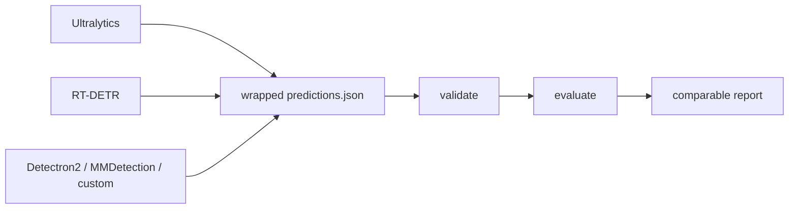

# YOLOZU (萬)

Japanese: [`Readme_jp.md`](Readme_jp.md) | Chinese: [`Readme_zh.md`](Readme_zh.md)

Company: [ToppyMicroServices OÜ](https://www.toppymicros.com/) | Official page: <https://www.toppymicros.com/yolozu/> | PyPI: <https://pypi.org/project/yolozu/> | Manual DOI: <https://doi.org/10.5281/zenodo.18744926>

## Evaluate existing predictions

YOLOZU is a commercial product developed by ToppyMicroServices OÜ and provided free of charge. The repository code is licensed under Apache-2.0.

Its stable product lane validates and fairly evaluates existing vision predictions through a stable predictions interface contract.

Give it a wrapped `predictions.json`, validate the predictions interface contract, and produce a comparable report.

The shortest core-install path is one strict dry-run command:

```bash
yolozu eval-coco -d /path/to/dataset -p /path/to/predictions.json --dry-run -o reports/coco_eval.json
```

For real COCO metrics, install `yolozu[coco]` and omit `--dry-run`.

## 1-Minute Demo

```bash
python3 -m pip install -U yolozu
yolozu doctor --proof
yolozu demo instance-seg --run-dir reports/quickstart_instance_seg --progress
```

Writes `reports/quickstart_instance_seg/instance_seg_demo_report.json` and visible PNG overlays under
`reports/quickstart_instance_seg/overlays/`.
The matching checklist lives at `configs/quickstart/instance_seg_demo.yaml`.
For the full CPU-only DoD path (`doctor --proof -> demo -> validate -> eval`), see
[`docs/cpu_only_dod.md`](docs/cpu_only_dod.md).
If you are unsure what to run next, use the built-in guide:

```bash
yolozu guide
yolozu guide --goal first-run
yolozu guide --goal evaluate
```

## Python And AI Quick Use

Use the typed in-process API when another Python program owns the workflow:

```python
from pathlib import Path

from yolozu.api import evaluate_coco

result = evaluate_coco(
    dataset=Path("/absolute/path/to/dataset"),
    predictions=Path("/absolute/path/to/predictions.json"),
    dry_run=True,
)
print(result.to_dict())
```

Give an AI client the small guaranteed-tool list before exposing wider surfaces:

```bash
yolozu-mcp --print-tools --guaranteed --ids-only
```

See [`docs/python_api.md`](docs/python_api.md) and
[`docs/ai_first.md`](docs/ai_first.md) for typed errors, workspace boundaries,
MCP setup, and larger opt-in discovery.

Before training, fail closed on an empty or invalid split and ask the train
doctor for a machine-readable readiness decision:

```bash
yolozu validate dataset /path/to/yolo_dataset --split train --strict
yolozu doctor train-dataset --dataset /path/to/yolo_dataset --split train --output -
```

For separate COCO annotation and image paths, use `--instances` together with
`--images-dir`; `--dataset` is not required. See
[`docs/training_inference_export.md`](docs/training_inference_export.md).



[](https://pypi.org/project/yolozu/)
[](https://pypi.org/project/yolozu/)
[](LICENSE)
[](https://github.com/ToppyMicroServices/YOLOZU/actions/workflows/build_and_test.yml)

## Read These First

- [`docs/README.md`](docs/README.md): top-level docs map and shortest working paths
- [`docs/predictions_schema.md`](docs/predictions_schema.md): the predictions interface contract
- [`docs/python_api.md`](docs/python_api.md): typed in-process validation/evaluation API and error policy
- [`docs/dataset_processing_matrix.md`](docs/dataset_processing_matrix.md): dataset source/target, preservation, and qualification boundaries
- [`docs/bop_tless_protocol.md`](docs/bop_tless_protocol.md): Research-stage BOP T-LESS rigid-object 6DoF protocol and evidence boundary
- [`docs/install.md`](docs/install.md): install, `doctor`, and environment setup
- [`docs/byop_quickstarts.md`](docs/byop_quickstarts.md): checked Ultralytics, Detectron2, MMDetection, and YOLOX export-to-report paths
- [`docs/case_studies/maskrcnn_eager_torchscript.md`](docs/case_studies/maskrcnn_eager_torchscript.md): real eager/TorchScript outputs evaluated through one pinned lane
- [Searchable web docs](https://www.toppymicros.com/yolozu/docs/): self-contained strict 30-minute path, typed Python API, generated commands and schemas, examples, glossary, and failure guide

## Primary Focus

- Stable lane: evaluate precomputed predictions fairly across frameworks and runtimes
- Bridge lane: export or external training flows that emit the same predictions interface contract
- Benchmark lane: qualify backend parity after the stable evaluation path is working
- Research lane: opt-in workflows over already evaluated artifacts

## Capability Maturity

- Stable: prediction validation/evaluation, wrapped `predictions.json`, repo smoke/demo path, install/doctor flow
- Experimental: backend parity, benchmark orchestration, external training handoff, macOS/MPS evaluation paths, TTA
- Research: continual learning, self-distillation, TTT, Hessian refinement, and BOP T-LESS rigid-object 6DoF

These are capability-level boundaries. A Stable parent CLI or manifest entry does not
promote opt-in subcommands or flags: `export_predictions` keeps baseline export Stable,
TTA Experimental, and TTT Research.

The BOP lane means rigid-object `R,t` pose, not human 3D skeleton pose. Its
real T-LESS diagnostic has strict GT, three-seed task-native before/after
evaluation, and an independent semantic reproduction. The follow-up exports
matched pose estimates for the official BOP19 test targets and evaluates them
with the pinned official toolkit. The lane remains Research because protocol
completion produced only small, seed-inconsistent official and task-native
scores; one seed had zero 0.1-diameter pose success. See the
[diagnostic report](reports/bop_tless_evidence_2026-07-30.md) and
[official-test report](reports/bop19_tless_official_evidence_2026-07-30.md).

The continual-learning lane now has a one-command, schema-defined three-seed
naive-versus-checkpoint-distillation diagnostic:
`./.venv/bin/python tools/qualify_sdft_continual.py --output-dir /tmp/yolozu-sdft-qualification`.
It runs real COCOeval and records baseline-relative FWT, hashes, time, memory,
and fairness checks. This is an SDFT-style detector regularizer rather than a
faithful reproduction of language-model SDFT, and it remains Research until
efficacy is established.
The completed 2026-07-28 run is a measured negative result: every real-COCOeval
matrix cell and every SDFT-minus-naive delta was zero, so the decision is
`hold` and efficacy is `not_established`. The hash-verified bundle is available
as a [GitHub prerelease](https://github.com/ToppyMicroServices/YOLOZU/releases/tag/sdft-evidence-2026-07-28);
the bundle has been independently reproduced in a second Python/Torch
environment. See the
[evidence report](reports/sdft_continual_evidence_2026-07-28.md).
The 2026-07-30 confirmatory spec produced non-zero task scores for all seeds,
and an independent run reproduced the protocol and gate outcomes. Two of three
seeds passed the preregistered retention/adaptation checks; seed 66 failed the
strict old-task improvement gate. Efficacy therefore remains
`not_established`; see the
[confirmatory report](reports/sdft_confirmatory_evidence_2026-07-30.md).

Experimental fine-tuning lanes can be audited in one command with
`./.venv/bin/python tools/qualify_finetune_lanes.py --output-dir /tmp/yolozu-finetune-qualification`.
The schema-defined result separates executed training from config projection,
records dependency failures and checkpoint/provenance hashes, and keeps the
lane Experimental when task-native metrics or non-heuristic labels are absent.
The bounded clean-source result remains `hold`; see the
[fine-tuning evidence report](reports/finetune_lane_evidence_2026-07-29.md).
The 2026-07-30 follow-up used strict T-LESS GT and executed real training in
Ultralytics, HF DETR, and Detectron2 across two environments; five other
external runtimes emitted structured availability failures. The
[runtime evidence](reports/external_runtime_evidence_2026-07-30.md) remains
Experimental and `hold`.
A compatible Linux/CUDA workflow separately completed non-dry training for
YOLOX, MMDetection, MMPose, MMSeg, and NVIDIA TAO in two independent runs on
the same pinned T4 stack. This establishes compatible-host runtime
availability and structural handoff reproducibility, not training quality or
checkpoint byte determinism. All five lanes remain Experimental / `hold`; see
the
[compatible-host report](reports/external_runtime_compatible_host_evidence_2026-07-30.md).

TTT comparisons can be run as a fail-closed multi-seed clean/shift matrix with
`tools/run_ttt_evidence_suite.py`; generated metrics do not promote the Research
lane. The bounded 2026-07-27 diagnostic bundle is available as a
[GitHub prerelease](https://github.com/ToppyMicroServices/YOLOZU/releases/tag/ttt-evidence-2026-07-27);
the archive SHA-256 is
`bb200d0c0a36447f0b6ed262a56ee09bef44ded8f10c55673243080fe1054068`.
All 30 matrix cells have been independently reproduced with zero semantic
differences. This establishes diagnostic reproducibility, not efficacy. See
[`docs/ttt_protocol.md`](docs/ttt_protocol.md).

## Production Readiness

- Production-ready today: prediction validation/evaluation and the predictions interface contract
- Needs qualification in your environment: backend parity, benchmark orchestration, SynthGen handoff, macOS/MPS paths
- Research-oriented: continual learning, self-distillation, TTT, Hessian refinement
- Full details: [`docs/production_readiness.md`](docs/production_readiness.md)

## Best Fit

- Compare predictions from multiple frameworks or runtimes on the same dataset and pinned evaluation protocol.
- Validate and wrap predictions from your own or a third-party vision stack before running one evaluation path.
- Add CI or regression reports that expose metric, preprocessing, or backend drift.

## Not The Best Fit

YOLOZU is not the best fit when you need a managed training platform, hosted inference service, guaranteed support or SLA, or one-click production deployment. If you evaluate only within one framework and do not need a stable cross-stack boundary, that framework's native evaluator may be simpler. Training, benchmark, adapter, and research capabilities are secondary qualified lanes, not the stable product promise.

## Why Not Just Use Framework-Native Evaluation?

Framework-native evaluation is convenient inside one stack, but it is harder to compare fairly across stacks. YOLOZU keeps the evaluation boundary at one predictions interface contract so the comparison path stays pinned even when the inference stack changes.

## Where To Go Next

- Evaluate precomputed predictions: [`docs/external_inference.md`](docs/external_inference.md)
- Bring your own model project: [`docs/byop_quickstarts.md`](docs/byop_quickstarts.md)
- Train, export, then evaluate: [`docs/training_inference_export.md`](docs/training_inference_export.md)
- YOLO-style and Detectron2 external training lanes (`yolozu train --external-backend yolox|detectron2|ultralytics|hf-detr ...`): [`docs/training_inference_export.md`](docs/training_inference_export.md)
- Current training support matrix and scope boundary: [`docs/training_inference_export.md#current-training-support`](docs/training_inference_export.md#current-training-support)
- Training backend interface / capability matrix / orchestration: [`docs/training_backend_interface.md`](docs/training_backend_interface.md), [`docs/training_capability_matrix.md`](docs/training_capability_matrix.md), [`docs/training_orchestration.md`](docs/training_orchestration.md)
- Qualify backend-parity and benchmark paths after the main eval lane is working: [`docs/backend_parity_matrix.md`](docs/backend_parity_matrix.md), [`docs/benchmark_mode.md`](docs/benchmark_mode.md), [`docs/benchmark_support_matrix.md`](docs/benchmark_support_matrix.md)
- Inspect a reproducible two-runtime comparison and its committed evidence: [`docs/case_studies/maskrcnn_eager_torchscript.md`](docs/case_studies/maskrcnn_eager_torchscript.md)
- Qualify a YOLOZU-synthgen handoff in one command: [`docs/synthgen_repo_integration.md`](docs/synthgen_repo_integration.md)
- Tool and manifest references: [`docs/tools_index.md`](docs/tools_index.md), [`tools/manifest.json`](tools/manifest.json)

## Secondary And Research Lanes

- Training, export, benchmark, SynthGen, and research workflows feed or extend the evaluation boundary.
- External training bridge: YOLOX first, optional Ultralytics and HF DETR bridges second
- SynthGen handoff: [`docs/synthgen_repo_integration.md`](docs/synthgen_repo_integration.md)
- Research workflows: [`docs/research_lanes.md`](docs/research_lanes.md)
- Real-image showcase: [`docs/assets/readme_multitask_showcase.png`](docs/assets/readme_multitask_showcase.png)

## Repo Users

```bash
python3 -m pip install -e .
bash scripts/smoke.sh
```

More repo-first guidance:

- Docs index: [`docs/README.md`](docs/README.md)
- Install details: [`docs/install.md`](docs/install.md)
- Manual sources: [`manual/README.md`](manual/README.md)

## Support, Feedback, And Legal

- Structured support and feedback: [`docs/support.md`](docs/support.md)
- License policy: [`docs/license_policy.md`](docs/license_policy.md)
- External training boundary: YOLOX first, optional Ultralytics and HF DETR bridges second
- Apache-2.0 license: [`LICENSE`](LICENSE)
- Latest release: [GitHub Releases](https://github.com/ToppyMicroServices/YOLOZU/releases)
- Zenodo software DOI: [10.5281/zenodo.18744756](https://doi.org/10.5281/zenodo.18744756)
- Zenodo manual DOI: [10.5281/zenodo.18744926](https://doi.org/10.5281/zenodo.18744926)
