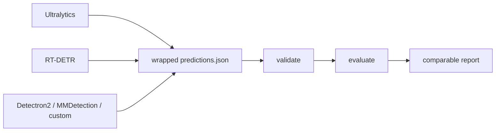

# YOLOZU (萬)

Japanese: [`Readme_jp.md`](Readme_jp.md) | Chinese: [`Readme_zh.md`](Readme_zh.md)

YOLOZU is an Apache-2.0 vision evaluation toolkit for teams that do not want workflow lock-in.

Bring your own inference.
Export once.
Evaluate fairly.

YOLOZU uses one stable predictions interface contract:
wrapped `predictions.json` with protocol-pinned `meta.export_settings`.

```bash
python3 -m pip install -U yolozu
yolozu demo overview
```

Writes `demo_output/overview/<utc>/demo_overview_report.json`.



[](https://pypi.org/project/yolozu/)
[](https://pypi.org/project/yolozu/)
[](LICENSE)
[](https://github.com/ToppyMicroServices/YOLOZU/actions/workflows/build_and_test.yml)

## Start Here

- Evaluate precomputed predictions: [`docs/README.md`](docs/README.md), [`docs/predictions_schema.md`](docs/predictions_schema.md), [`docs/external_inference.md`](docs/external_inference.md)
- Train, export, then evaluate: [`docs/training_inference_export.md`](docs/training_inference_export.md), [`docs/run_contract.md`](docs/run_contract.md)
- Compare backends and benchmark paths: [`docs/backend_parity_matrix.md`](docs/backend_parity_matrix.md), [`docs/benchmark_mode.md`](docs/benchmark_mode.md), [`docs/tensorrt_pipeline.md`](docs/tensorrt_pipeline.md)
- Prepare YOLOZU-synthgen handoff: [`docs/synthgen_repo_integration.md`](docs/synthgen_repo_integration.md), [`docs/synthgen_intake.md`](docs/synthgen_intake.md), [`docs/synthgen_contract.md`](docs/synthgen_contract.md)
- Install and environment setup: [`docs/install.md`](docs/install.md), [`docs/doctor_diagnostics.md`](docs/doctor_diagnostics.md)
- Tool and manifest references: [`docs/tools_index.md`](docs/tools_index.md), [`tools/manifest.json`](tools/manifest.json)

## Quick Answers

- Good fit if you already have predictions and want fair cross-framework evaluation.
- Good fit if you need Apache-2.0-friendly tooling for commercial or internal use.
- Probably not a fit if you want a single end-to-end training framework with one-click defaults.
- GPU is optional. The default demo path is CPU-friendly.
- You do not need to train inside YOLOZU to use it.
- The main artifact is wrapped `predictions.json` with `meta.export_settings`.

## Demos And Examples

- 30-second demo: `yolozu demo overview`
- Real-image showcase: [`docs/assets/readme_multitask_showcase.png`](docs/assets/readme_multitask_showcase.png)
- Learning and advanced workflows: [`docs/learning_features.md`](docs/learning_features.md)
- Distillation: [`docs/distillation.md`](docs/distillation.md)
- Continual learning: [`docs/continual_learning.md`](docs/continual_learning.md)
- Hessian refinement: [`docs/hessian_solver.md`](docs/hessian_solver.md)

## Repo Users

```bash
python3 -m pip install -e .
bash scripts/smoke.sh
```

More repo-first guidance:

- Docs index: [`docs/README.md`](docs/README.md)
- Install details: [`docs/install.md`](docs/install.md)
- Manual sources: [`manual/README.md`](manual/README.md)

## Support And Legal

- Support: [`docs/support.md`](docs/support.md)
- License policy: [`docs/license_policy.md`](docs/license_policy.md)
- Apache-2.0 license: [`LICENSE`](LICENSE)
- Latest release: [GitHub Releases](https://github.com/ToppyMicroServices/YOLOZU/releases)
- Zenodo software DOI: [10.5281/zenodo.18744756](https://doi.org/10.5281/zenodo.18744756)
- Zenodo manual DOI: [10.5281/zenodo.18744926](https://doi.org/10.5281/zenodo.18744926)
