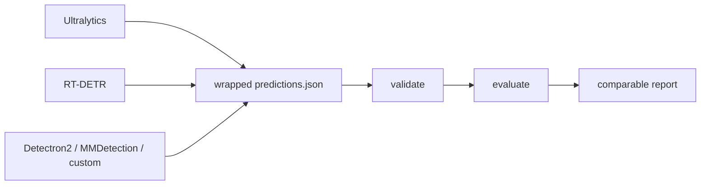

# YOLOZU (萬)

Japanese: [`Readme_jp.md`](Readme_jp.md) | Chinese: [`Readme_zh.md`](Readme_zh.md)

YOLOZU is an Apache-2.0 vision evaluation toolkit for teams that do not want workflow lock-in.

Bring your own inference.
Export once.
Evaluate fairly.

YOLOZU uses one stable predictions interface contract:
wrapped `predictions.json` with protocol-pinned `meta.export_settings`.

## 1-Minute Demo

```bash
python3 -m pip install -U yolozu
yolozu doctor --explain
yolozu demo instance-seg --run-dir reports/quickstart_instance_seg --progress
```

Writes `reports/quickstart_instance_seg/instance_seg_demo_report.json` and visible PNG overlays under
`reports/quickstart_instance_seg/overlays/`.
The matching checklist lives at `configs/quickstart/instance_seg_demo.yaml`.
If you are unsure what to run next, use the built-in guide:

```bash
yolozu guide
yolozu guide --goal first-run
yolozu guide --goal evaluate
```



[](https://pypi.org/project/yolozu/)
[](https://pypi.org/project/yolozu/)
[](LICENSE)
[](https://github.com/ToppyMicroServices/YOLOZU/actions/workflows/build_and_test.yml)

## Read These First

- [`docs/README.md`](docs/README.md): top-level docs map and shortest working paths
- [`docs/predictions_schema.md`](docs/predictions_schema.md): the predictions interface contract
- [`docs/install.md`](docs/install.md): install, `doctor`, and environment setup

## Primary Focus

- Main lane: evaluate precomputed predictions fairly across frameworks and runtimes
- Secondary lane: export and reference training lanes that feed the same predictions interface contract
- Secondary external lane: Apache-2.0-friendly YOLOX-style training bridge, with optional external copyleft-sensitive bridges kept separate
- Advanced lane: continual learning, TTT, SynthGen, and backend parity research paths

## Capability Maturity

- Stable: prediction validation/evaluation, wrapped `predictions.json`, repo smoke/demo path, install/doctor flow
- Experimental: backend parity, benchmark orchestration, SynthGen intake and handoff, macOS/MPS evaluation paths
- Research: continual learning, self-distillation, TTT, Hessian refinement

## Production Readiness

- Production-ready today: prediction validation/evaluation and the predictions interface contract
- Needs qualification in your environment: backend parity, benchmark orchestration, SynthGen handoff, macOS/MPS paths
- Research-oriented: continual learning, self-distillation, TTT, Hessian refinement
- Full details: [`docs/production_readiness.md`](docs/production_readiness.md)

## Who This Is For

- You already have predictions and want fair cross-framework evaluation.
- You want an Apache-2.0 evaluation layer without rewriting your training stack.
- You do not want framework-native evaluation differences to become silent metric drift.

## Not The Best Fit

- You want one end-to-end training framework with one-click defaults.
- You do not need cross-framework comparison or a stable predictions interface contract.

## Why Not Just Use Framework-Native Evaluation?

Framework-native evaluation is convenient inside one stack, but it is harder to compare fairly across stacks. YOLOZU keeps the evaluation boundary at one predictions interface contract so the comparison path stays pinned even when the inference stack changes.

## Where To Go Next

- Evaluate precomputed predictions: [`docs/external_inference.md`](docs/external_inference.md)
- Train, export, then evaluate: [`docs/training_inference_export.md`](docs/training_inference_export.md)
- YOLO-style and Detectron2 external training lanes (`yolozu train --external-backend yolox|detectron2|ultralytics|hf-detr ...`): [`docs/training_inference_export.md`](docs/training_inference_export.md)
- Current training support matrix and scope boundary: [`docs/training_inference_export.md#current-training-support`](docs/training_inference_export.md#current-training-support)
- Training backend interface / capability matrix / orchestration: [`docs/training_backend_interface.md`](docs/training_backend_interface.md), [`docs/training_capability_matrix.md`](docs/training_capability_matrix.md), [`docs/training_orchestration.md`](docs/training_orchestration.md)
- Qualify backend-parity and benchmark paths after the main eval lane is working: [`docs/backend_parity_matrix.md`](docs/backend_parity_matrix.md), [`docs/benchmark_mode.md`](docs/benchmark_mode.md), [`docs/benchmark_support_matrix.md`](docs/benchmark_support_matrix.md)
- Prepare YOLOZU-synthgen handoff: [`docs/synthgen_repo_integration.md`](docs/synthgen_repo_integration.md)
- Tool and manifest references: [`docs/tools_index.md`](docs/tools_index.md), [`tools/manifest.json`](tools/manifest.json)

## More Than The Demo

- Advanced docs map: [`docs/README.md`](docs/README.md)
- Real-image showcase: [`docs/assets/readme_multitask_showcase.png`](docs/assets/readme_multitask_showcase.png)
- Learning and research workflows: [`docs/learning_features.md`](docs/learning_features.md)

## Repo Users

```bash
python3 -m pip install -e .
bash scripts/smoke.sh
```

More repo-first guidance:

- Docs index: [`docs/README.md`](docs/README.md)
- Install details: [`docs/install.md`](docs/install.md)
- Manual sources: [`manual/README.md`](manual/README.md)

## Support And Legal

- Support: [`docs/support.md`](docs/support.md)
- License policy: [`docs/license_policy.md`](docs/license_policy.md)
- External training boundary: YOLOX first, optional Ultralytics and HF DETR bridges second
- Apache-2.0 license: [`LICENSE`](LICENSE)
- Latest release: [GitHub Releases](https://github.com/ToppyMicroServices/YOLOZU/releases)
- Zenodo software DOI: [10.5281/zenodo.18744756](https://doi.org/10.5281/zenodo.18744756)
- Zenodo manual DOI: [10.5281/zenodo.18744926](https://doi.org/10.5281/zenodo.18744926)
