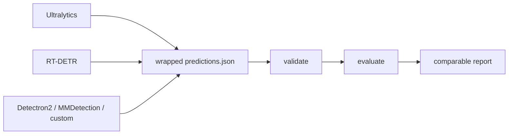

# YOLOZU (萬) — 日本語README

English: [`README.md`](README.md) | 中文: [`Readme_zh.md`](Readme_zh.md)

YOLOZU は、workflow を単一の training framework に lock-in したくないチーム向けの Apache-2.0 vision evaluation toolkit です。

Bring your own inference.
Export once.
Evaluate fairly.

YOLOZU が基準にするのは、安定した predictions interface contract です。
中身は wrapped `predictions.json` と、その中の protocol-pinned な `meta.export_settings` です。

推論スタックが変わっても、比較の公正さを崩さないこと。それが
YOLOZU のいちばん大きな約束です。

## 1分デモ

```bash
python3 -m pip install -U yolozu
yolozu demo overview
```

出力: `demo_output/overview/<utc>/demo_overview_report.json`



[](https://pypi.org/project/yolozu/)
[](https://pypi.org/project/yolozu/)
[](LICENSE)
[](https://github.com/ToppyMicroServices/YOLOZU/actions/workflows/build_and_test.yml)

## Quick Menu

- まず触る: 下の 1分デモを試してから [`docs/README.md`](docs/README.md)
  を開く
- 核心をつかむ:
  [`docs/predictions_schema.md`](docs/predictions_schema.md),
  [`docs/external_inference.md`](docs/external_inference.md),
  [`docs/install.md`](docs/install.md)
- 進み方を選ぶ: 既存 predictions の評価、train→export→eval、または
  benchmark/parity の検証へ進む
- 深く入る前に境界を確認する:
  [`docs/production_readiness.md`](docs/production_readiness.md),
  [`docs/support.md`](docs/support.md),
  [`docs/license_policy.md`](docs/license_policy.md)

## 最初に読む3本

- [`docs/README.md`](docs/README.md): docs 全体の入口と最短の使い方
- [`docs/predictions_schema.md`](docs/predictions_schema.md): predictions interface contract
- [`docs/install.md`](docs/install.md): install、`doctor`、環境確認

## 進み方メニュー

いま手元にあるものに合わせて、入口を選べます。

- 既存 predictions を評価する:
  [`docs/external_inference.md`](docs/external_inference.md)
- train → export → eval を試す:
  [`docs/training_inference_export.md`](docs/training_inference_export.md)
- backend parity や benchmark を詰める:
  [`docs/backend_parity_matrix.md`](docs/backend_parity_matrix.md),
  [`docs/benchmark_mode.md`](docs/benchmark_mode.md)
- YOLOZU-synthgen 連携を準備する:
  [`docs/synthgen_repo_integration.md`](docs/synthgen_repo_integration.md)
- tool / manifest を確認する:
  [`docs/tools_index.md`](docs/tools_index.md),
  [`tools/manifest.json`](tools/manifest.json)

## YOLOZU が得意なこと

- 主戦場: 既存 predictions を framework / runtime をまたいで公平に評価すること
- 次のレイヤ: 同じ predictions interface contract へつなぐ export と reference training lane
- 外部 training lane: Apache-2.0 に寄せやすい YOLOX-style bridge。copyleft-sensitive な bridge は optional に分離
- 発展レイヤ: continual learning、TTT、SynthGen、backend parity の research path

## 安定度の見取り図

- Stable: prediction validation/evaluation、wrapped `predictions.json`、repo smoke/demo path、install/doctor
- 環境ごとの検証が必要なもの: backend parity、benchmark orchestration、SynthGen handoff、macOS/MPS path
- research-oriented なもの: continual learning、self-distillation、TTT、Hessian refinement
- 詳細: [`docs/production_readiness.md`](docs/production_readiness.md)

## 向いているケース

- 既に predictions があり、framework をまたいで公平比較したい
- training stack はそのままに、Apache-2.0 の evaluation layer だけ導入したい
- framework-native evaluation の差を、そのまま比較結果に持ち込みたくない

## あまり向いていないケース

- one-click default の end-to-end training framework が欲しい
- cross-framework comparison や stable な predictions interface contract が不要

## Why not framework-native evaluation?

1つの framework の中だけなら framework-native evaluation は便利です。ただし stack をまたぐと比較条件がずれやすくなります。YOLOZU は評価境界を 1 つの predictions interface contract に固定し、inference 実装が変わっても比較経路を pinned に保ちます。

## demo の先へ

- advanced docs map: [`docs/README.md`](docs/README.md)
- 実画像 showcase: [`docs/assets/readme_multitask_showcase.png`](docs/assets/readme_multitask_showcase.png)
- 学習系 / research workflow: [`docs/learning_features.md`](docs/learning_features.md)
- YOLO-style / Detectron2 external training lane（`yolozu train --external-backend yolox|detectron2|ultralytics|hf-detr ...`）:
  [`docs/training_inference_export.md`](docs/training_inference_export.md)
- 現在の training support matrix と scope 境界:
  [`docs/training_inference_export.md#current-training-support`](docs/training_inference_export.md#current-training-support)
- training backend interface / capability matrix / orchestration:
  [`docs/training_backend_interface.md`](docs/training_backend_interface.md),
  [`docs/training_capability_matrix.md`](docs/training_capability_matrix.md),
  [`docs/training_orchestration.md`](docs/training_orchestration.md)

## repo checkout で使うとき

```bash
python3 -m pip install -e .
bash scripts/smoke.sh
```

詳しくは次を見てください。

- docs index: [`docs/README.md`](docs/README.md)
- install 詳細: [`docs/install.md`](docs/install.md)
- manual source: [`manual/README.md`](manual/README.md)

## Support・Scope・License

- Support: [`docs/support.md`](docs/support.md)
- License policy: [`docs/license_policy.md`](docs/license_policy.md)
- External training boundary: YOLOX first, optional Ultralytics / HF DETR bridges second
- Apache-2.0 license: [`LICENSE`](LICENSE)
- Latest release: [GitHub Releases](https://github.com/ToppyMicroServices/YOLOZU/releases)
- Zenodo software DOI: [10.5281/zenodo.18744756](https://doi.org/10.5281/zenodo.18744756)
- Zenodo manual DOI: [10.5281/zenodo.18744926](https://doi.org/10.5281/zenodo.18744926)
