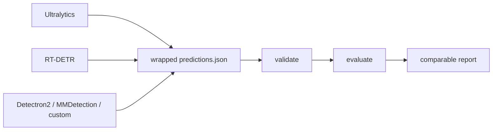

# YOLOZU (萬) - 日本語README

English: [`README.md`](README.md) | 中文: [`Readme_zh.md`](Readme_zh.md)

Company: [ToppyMicroServices OÜ](https://www.toppymicros.com/) | Official page: <https://www.toppymicros.com/yolozu/> | PyPI: <https://pypi.org/project/yolozu/> | Manual DOI: <https://doi.org/10.5281/zenodo.18744926>

## Evaluate existing predictions

YOLOZU は ToppyMicroServices OÜ が開発する商用プロダクトで、無料で提供しています。リポジトリのコードは Apache-2.0 でライセンスされています。

stable product lane では、stable predictions interface contract を通じて既存の vision predictions を検証し、公平に評価します。

wrapped `predictions.json` を渡し、predictions interface contract を検証し、比較可能な report を作ります。

標準 install での最短経路は、strict validation を内包する dry-run 1コマンドです。

```bash
yolozu eval-coco -d /path/to/dataset -p /path/to/predictions.json --dry-run -o reports/coco_eval.json
```

実際の COCO metrics には `yolozu[coco]` を install し、`--dry-run` を外します。

## 1分デモ

```bash
python3 -m pip install -U yolozu
yolozu doctor --proof
yolozu demo instance-seg --run-dir reports/quickstart_instance_seg --progress
```

出力: `reports/quickstart_instance_seg/instance_seg_demo_report.json`
可視化PNG: `reports/quickstart_instance_seg/overlays/`
対応するチェックリスト: `configs/quickstart/instance_seg_demo.yaml`
CPU-only の完全な DoD path（`doctor --proof -> demo -> validate -> eval`）は
[`docs/cpu_only_dod.md`](docs/cpu_only_dod.md) に固定しています。
次に何を実行すればよいか迷ったら、CLI 内蔵の guide を使えます。

```bash
yolozu guide
yolozu guide --goal first-run
yolozu guide --goal evaluate
```

## Python / AI から最短で使う

workflow を別の Python program が管理する場合は、typed in-process API を使えます。

```python
from pathlib import Path

from yolozu.api import evaluate_coco

result = evaluate_coco(
    dataset=Path("/absolute/path/to/dataset"),
    predictions=Path("/absolute/path/to/predictions.json"),
    dry_run=True,
)
print(result.to_dict())
```

AI client には、まず小さな guaranteed tool list だけを渡せます。

```bash
yolozu-mcp --print-tools --guaranteed --ids-only
```

typed error、workspace boundary、MCP setup、広い opt-in discovery は
[`docs/python_api.md`](docs/python_api.md) と
[`docs/ai_first.md`](docs/ai_first.md) を参照してください。

training 前には、空または不正な split を fail closed で検査し、train doctor
から machine-readable な readiness 判定を取得します。

```bash
yolozu validate dataset /path/to/yolo_dataset --split train --strict
yolozu doctor train-dataset --dataset /path/to/yolo_dataset --split train --output -
```

COCO annotation と画像を別々に指定する場合は、`--instances` と
`--images-dir` を併用します。この経路では `--dataset` は不要です。詳細は
[`docs/training_inference_export.md`](docs/training_inference_export.md) を参照してください。



[](https://pypi.org/project/yolozu/)
[](https://pypi.org/project/yolozu/)
[](LICENSE)
[](https://github.com/ToppyMicroServices/YOLOZU/actions/workflows/build_and_test.yml)

## 最初に読む3本

- [`docs/README.md`](docs/README.md): docs 全体の入口と最短の使い方
- [`docs/predictions_schema.md`](docs/predictions_schema.md): predictions interface contract
- [`docs/python_api.md`](docs/python_api.md): typed in-process validation/evaluation API と error policy
- [`docs/dataset_processing_matrix.md`](docs/dataset_processing_matrix.md): dataset の source/target、保持項目、qualification 境界
- [`docs/bop_tless_protocol.md`](docs/bop_tless_protocol.md): BOP T-LESS の rigid-object 6DoF Research protocol と evidence 境界
- [`docs/install.md`](docs/install.md): install、`doctor`、環境確認
- [`docs/byop_quickstarts.md`](docs/byop_quickstarts.md): Ultralytics、Detectron2、MMDetection、YOLOX から共通 report までの検査済み手順
- [`docs/case_studies/maskrcnn_eager_torchscript.md`](docs/case_studies/maskrcnn_eager_torchscript.md): eager / TorchScript の実出力を同じ評価経路で比較した再現可能な事例
- [検索可能な web docs](https://www.toppymicros.com/yolozu/docs/): 入力を先に生成する strict 30分 path、typed Python API、生成済み command/schema reference

## Primary Focus

- Stable lane: 既存 predictions を framework / runtime をまたいで公平に評価すること
- Bridge lane: 同じ predictions interface contract を出す export / external training flow
- Benchmark lane: stable evaluation path が動いた後に backend parity を検証すること
- Research lane: 評価済み artifact に対する opt-in workflow

## Adaptive local vision roadmap

環境に応じたlocal画像処理は、引き続きExperimental delivery workです。現在のStableなprediction validation/evaluationの提供範囲は変わりません。

目標とする設計では、AI clientが自然言語をtyped requestへ変換し、YOLOZUはtask、hardware、runtime、workload、protocol、licenseの条件に一致するqualification済みpipelineだけを選択対象にします。証拠が不足または不一致なら、“best”を推測せずabstainします。recommendationとexecutionはlocalで動き、assetを暗黙にdownloadしません。

request、environment、evidence、eligibility observation、SelectionDecision の
厳密な interface contract は packaged 済みです。`yolozu doctor --output -` は
privacy-safe な live `environment_profile` を返します。probe failure は unknown
のままで、accelerator 不在の証明には使いません。packaged bundle registryには、
既存model zooと一致するYOLOX-S、Detectron2 Faster R-CNN R50-FPN 1x、
MMDetection Faster R-CNN R50-FPN 1xの3件を、未昇格のCandidate baselineとして
登録しています。固定済みweightは取得可能なmetadataですが、adaptive execution
bindingは明示的にunboundです。model runtimeをimportせずに検証して読み込めます。明示したworkspace
catalogはoperator-assertedのままで、選択対象にはなりません。
Experimental `yolozu scout-algorithms` はcanonicalなofficial-source allowlistだけを
検証し、`--collect`を明示した場合だけ日付付きcandidate inboxを作ります。defaultは
network-freeかつwrite-freeのplanです。取得した内容はuntrusted metadataとして扱い、raw
documentは保持しません。このinboxをAlgorithmBundle registryとしてloadしたり、qualification、
support、recommendation、adoption、promotionの証拠として使うことはできません。
Experimental `yolozu check-qualification-freshness` は、activeなqualificationの
期限とgoverned runtime/bundle driftをread-onlyで確認します。qualificationの再実行や
期限延長は行いません。repository scheduleが保持するのはboundedなpublic IDだけで、
明示したsite evidence rootの内容はlocal-onlyのまま外部へuploadしません。
contract-onlyの[OCR result boundary](docs/ocr_interface_contract.md)では、recognized textを
detection labelと分離したinertかつuntrustedなuser outputとして扱います。OCR model、adapter、
document parser、remote service、support claimは含みません。
candidate screeningは、実行を伴わない独立したinterface contractとして実装しました。
provenance、integrity、code/weight/dataset license、local availability、task/output、
runtime、resource、maintenance、security、human reviewを分離し、pass、hold、rejectを
決定します。必須項目のunknownはholdです。packagedのappend-only screening streamには
2026-08-29の[candidate review](docs/adaptive_candidate_screenings_2026-08-29.md)で得た
currentな`hold`が2件あります。workspace inputは常にoperator-assertedです。managed passは
ないため、この実装だけで利用可能なcandidateが増えることはありません。POSIX専用の
Experimental `yolozu qualify-image-pipeline` commandは、pinned no-follow input/asset
preflight、固定したrepeat/soak protocol、child processのbounded cancellation、
unactivatedな`qualification_report.json`のatomic publicationを実装しています。
Experimental `yolozu activate-qualification-evidence` は、review、trust、freshness、
registry/lifecycle、stale-head の全gateをdry-runで確認し、`--approve`を明示した場合
だけactivation、supersession、terminal revocationをatomicに追記します。
Experimental `yolozu review-image-pipeline-support-profiles` は、exact-measuredな
target profileの完全なordered setを別工程でreviewします。sole packaged SSOTである
`support_profiles.jsonl`だけを読み、`--approve`時だけatomicに追記します。review済み
setはdormantのままで、lifecycle pointer、evidence activation、runner binding、model
download、現在利用可能というsupport claimを変更しません。streamは現在空です。
recommendationとexecutionは同じloader-derived providerを使い、executionはrunner
sessionを開く直前にlifecycleが固定したhistorical setを再projectします。
Experimental `yolozu update-image-pipeline-lifecycle` は別のreviewedかつdry-run-firstな
maintenance interface contractです。exactなdisable、enable、license review、全channelに
効くterminal revoke、channel単位の明示的rollbackを扱います。変更には`--approve`、観測した
lifecycle/support head、immutableなbundle/artifact identity、approved public reviewが必要です。
`none`以外へのrollbackは、同一familyのeligible targetについてhistoricalなadvertised profile
set全体とprofileごとのcurrent repository-managed activationをexactに復元します。新しいdormant
targetの自動選択、callerが作ったsubset、未割当Candidateをpromotionの迂回路にすること、
promotion、metricだけを根拠とする変更は行わず、rollback eventにはhistorical target assignment
のexact digestを記録します。
この変更ではcanonical lifecycle eventを追記していません。
Experimental `yolozu promote-image-pipeline` は、独立したreviewed promotion pathを
実装します。Candidate-to-ExperimentalとExperimental-to-Stableは別操作で、`--approve`を
省略すると必ずwrite-free dry-runになります。exactなsource/target pointerとstream head、
canonicalなordered support-profile set全体、profileごとのcurrent repository-managed
activationが必要です。Stableではさらに、bounded failure-drill reportのpass、automationと
別のhuman repository approval、preregistered absolute gate全体、comparatorがある場合の
current Stable reportとのexactなzero-tolerance比較を要求します。site-managed evidence、
approvalの推測、Stable profile setの変更は受け付けず、bundle/support/screening/evidence/
report/artifact inputは変更しません。この実装ではmodelをpromotionしていないため、packaged
streamはCandidate-onlyのままです。
localで生成したreportは
`site_managed` / `site_qualified`までで、任意のworkspace JSONは選択対象に
なりません。repository-managed trustには、追跡されたreview workflowとpublic review
referenceが別途必要です。
ただし3件にadaptive runnerはまだbindされていません。そのため
現在はdummy evidenceを作らず、理由を示して停止します。内部のpure selectorは、
検証済みのin-memory observationだけを対象に、固定したtrust、compatibility、artifact、
evidence、performance、deterministic rankingの規則を適用します。provider file、model、
runner、networkへのI/Oは行いません。ExperimentalかつMCP-onlyの
`recommend_image_pipeline`は、この方針をread-onlyのstructured recommendationとして
公開します。typed jobとlocal inputを検証し、artifactを読む前にnon-I/O gateを適用して、
完全なSelectionDecisionまたは正直なabstentionを返します。inference、assetのdownloadや
write、自然言語parse、absolute pathやraw probe outputの返却は行いません。3件は
Candidateのままでpublic evidence streamも空なので、default callは現在
`maturity_disallowed`でabstainします。model
adapterはまだありません。ExperimentalかつMCP-onlyの`process_images`は、完全なselected
decisionを受け取り、job、現在のlifecycle/evidence、environment、workload、input、class mapping、
pinned artifact stateを再検証します。defaultは書き込みを行わない`dry_run=true`です。明示的な
実行では、登録済みのcode-ownedかつnetwork-freeなrouteだけを使い、managedな
predictions/provenance/checksum treeをatomicに公開します。ただしadaptive runner
mapは空のため、現時点で実際のadaptive modelは実行できず、model adapterや性能実績を追加した
ものではありません。activation
recordだけでmodelの選択や実行は行いません。registryの
読み込み、environment profile、smoke結果、output publicationだけでは
qualification evidenceにもhuman adoptionの証明にもなりません。

[baseline bundle registry report](reports/adaptive_baseline_bundle_registry_2026-08-26.md)
に現在の3段階の境界を記録しています。先行する
[algorithm scout foundation report](reports/adaptive_algorithm_scout_foundation_2026-08-26.md)
にはmonitored-source、retention、parser、nonselectionの境界を記録しています。先行する
[candidate screening foundation report](reports/adaptive_candidate_screening_foundation_2026-08-26.md)
にはfail-closed screeningとpath-derived trustの境界を記録しています。先行する
[lifecycle maintenance and rollback report](reports/adaptive_lifecycle_rollback_foundation_2026-08-26.md)
にはreviewed mutation、immutable history、exact rollbackの境界を記録しています。先行する
[installed-artifact verification report](reports/adaptive_routing_installed_verification_2026-08-26.md)
では、source、sdist、wheel、installed MCP callで同じ境界を確認しています。positiveな
selector/executor caseは内部fixtureによるもので、実bundleのqualificationやselectedな
public runを示すものではありません。

生成した[roadmap report](reports/adaptive_vision_roadmap.md)、packagedされた[machine-readable projection](yolozu/data/manifest/adaptive_vision_roadmap.json)、[Beadsの同期規則](docs/roadmap.md)を参照してください。

## Capability Maturity

- Stable: prediction validation/evaluation、wrapped `predictions.json`、repo smoke/demo path、install/doctor
- Experimental: backend parity、benchmark orchestration、external training handoff、macOS/MPS evaluation path、TTA
- Research: continual learning、self-distillation、TTT、Hessian refinement、BOP T-LESS rigid-object 6DoF

これは capability-level の境界です。Stable の親 CLI や manifest entry が opt-in の
subcommand/flag を昇格させるわけではありません。`export_predictions` では baseline
export は Stable、TTA は Experimental、TTT は Research のままです。

BOP lane の pose は rigid-object の `R,t` を意味し、人の 3D skeleton pose
には対応しません。実 T-LESS 診断について strict GT、3 seed の task-native
before/after、独立 semantic reproduction まで完了しました。追加検証では
official BOP19 test target 向けの matched pose estimate を export し、pin した
official toolkit で評価します。protocol 完了だけでは pose efficacy を確立
せず、official/task-native score は小さく seed 間で不安定で、1 seed は
0.1-diameter pose success が 0 でした。そのため Research のままです。詳細は
[診断 report](reports/bop_tless_evidence_2026-07-30.md)と
[official-test report](reports/bop19_tless_official_evidence_2026-07-30.md)を
参照してください。

continual-learning lane には、schema 定義済みの3 seed
naive-versus-checkpoint-distillation 診断を1 commandで実行する経路があります:
`./.venv/bin/python tools/qualify_sdft_continual.py --output-dir /tmp/yolozu-sdft-qualification`。
実 COCOeval、initial-checkpoint 基準の FWT、hash、時間、memory、公平性チェックを
記録します。これは language-model SDFT の忠実な再現ではなく、detector 向けの
SDFT-style regularizer です。efficacy が確立するまでは Research のままです。
2026-07-28 の実行結果は陰性で、実 COCOeval の全 matrix cell と
SDFT-minus-naive delta が 0 でした。したがって判定は `hold`、efficacy は
`not_established` です。hash 検証済み bundle は
[GitHub prerelease](https://github.com/ToppyMicroServices/YOLOZU/releases/tag/sdft-evidence-2026-07-28)
で公開しており、別の Python/Torch 環境で独立再現済みです。efficacy は未確立の
ままです。詳細は
[evidence report](reports/sdft_continual_evidence_2026-07-28.md)に記録しています。
2026-07-30 の confirmatory spec では全 seed で非ゼロ task score を得て、
protocol と gate outcome を独立再現しました。ただし事前登録した
retention/adaptation check の通過は 3 seed 中 2 seed で、seed 66 は strict
old-task improvement gate に失敗しました。そのため efficacy は
`not_established` のままです。詳細は
[confirmatory report](reports/sdft_confirmatory_evidence_2026-07-30.md)を
参照してください。

Experimental な fine-tuning lane は
`./.venv/bin/python tools/qualify_finetune_lanes.py --output-dir /tmp/yolozu-finetune-qualification`
の1 commandで監査できます。schema 定義済みの結果は実 training と config
projection を分離し、dependency failure、checkpoint/provenance hashを記録します。
task-native metricや非heuristic labelが不足する場合はExperimentalのままです。
clean sourceでの限定実行結果は`hold`です。詳細は
[fine-tuning evidence report](reports/finetune_lane_evidence_2026-07-29.md)
を参照してください。
2026-07-30 の追加検証では strict T-LESS GT を使い、Ultralytics、HF DETR、
Detectron2 の実 training を2環境で再現しました。他の5 runtimeは実 launcher
から構造化された availability failure を出しています。
[runtime evidence](reports/external_runtime_evidence_2026-07-30.md)の判定は
Experimental / `hold` です。
別の compatible Linux/CUDA workflow では、同一の pin 済み T4 stack 上で
YOLOX、MMDetection、MMPose、MMSeg、NVIDIA TAO の non-dry training を
2回独立に完了しました。これは compatible-host runtime availability と
structural handoff の再現性を示しますが、training quality や checkpoint の
byte 決定性は示しません。5 lane は Experimental / `hold` のままです。詳細は
[compatible-host report](reports/external_runtime_compatible_host_evidence_2026-07-30.md)
に記録しています。

`tools/run_ttt_evidence_suite.py` で fail-closed な multi-seed の
clean/shift matrix を実行できます。生成された metric だけで Research lane
を昇格させることはありません。2026-07-27 の限定的な診断bundleは
[GitHub prerelease](https://github.com/ToppyMicroServices/YOLOZU/releases/tag/ttt-evidence-2026-07-27)
で公開しています。archive SHA-256 は
`bb200d0c0a36447f0b6ed262a56ee09bef44ded8f10c55673243080fe1054068` です。
全30 matrix cell は独立環境で semantic difference 0として再現済みです。
これは診断の再現性を示しますが、efficacy は示しません。詳細は
[`docs/ttt_protocol.md`](docs/ttt_protocol.md)を参照してください。

別の 2026-08-01 local diagnostic では、full compatibility を満たすより強い
source checkpoint と detector-native response objective を使いました。final
no-object class を除外し、信頼できる foreground query だけを選び、弱い
photometric view 間で同一 query の class/box consistency を取ります。選択数が
設定した最小値未満なら backward と optimizer を実行せず、normalization buffer
を復元して abstain します。固定した
10画像の clean/shifted fixture では COCO mAP50:95 がそれぞれ
`0.000990→0.001188`、`0.000330→0.000396` となり、guard stop は0件でした。
これは限定的な正の観測であり、独立 evidence や efficacy claim ではありません。
詳細は [detection-native report](reports/ttt_detection_native_evidence_2026-08-01.md)
を参照してください。

## Production Readiness

- いま production-ready と言いやすいもの: prediction validation/evaluation と predictions interface contract
- 環境ごとの検証が必要なもの: backend parity、benchmark orchestration、SynthGen handoff、macOS/MPS path
- research-oriented なもの: continual learning、self-distillation、TTT、Hessian refinement
- 詳細: [`docs/production_readiness.md`](docs/production_readiness.md)

## 特に向いている3つのケース

- 同じ dataset と固定した evaluation protocol で、複数の framework / runtime の predictions を比較する
- 自社または third-party の vision stack が出した predictions を検証・wrap し、1つの evaluation path で評価する
- metric、preprocessing、backend の drift を検出する CI / regression report を追加する

## あまり向いていないケース

managed training platform、hosted inference service、保証付き support / SLA、または one-click production deployment が必要な場合、YOLOZU は最適ではありません。1つの framework 内だけで評価し、stable cross-stack boundary が不要なら、その framework-native evaluator の方が簡単です。training、benchmark、adapter、research capability は、stable product promise ではなく、検証条件付きの secondary lane です。

## Why not framework-native evaluation?

1つの framework の中だけなら framework-native evaluation は便利です。ただし stack をまたぐと比較条件がずれやすくなります。YOLOZU は評価境界を 1 つの predictions interface contract に固定し、inference 実装が変わっても比較経路を pinned に保ちます。

## 次に見る場所

- 既存 predictions を評価する: [`docs/external_inference.md`](docs/external_inference.md)
- 既存 model project から持ち込む: [`docs/byop_quickstarts.md`](docs/byop_quickstarts.md)
- train → export → eval を試す: [`docs/training_inference_export.md`](docs/training_inference_export.md)
- YOLO-style / Detectron2 external training lane（`yolozu train --external-backend yolox|detectron2|ultralytics|hf-detr ...`）: [`docs/training_inference_export.md`](docs/training_inference_export.md)
- 現在の training support matrix と scope 境界: [`docs/training_inference_export.md#current-training-support`](docs/training_inference_export.md#current-training-support)
- training backend interface / capability matrix / orchestration: [`docs/training_backend_interface.md`](docs/training_backend_interface.md), [`docs/training_capability_matrix.md`](docs/training_capability_matrix.md), [`docs/training_orchestration.md`](docs/training_orchestration.md)
- backend 比較や benchmark を見る: [`docs/backend_parity_matrix.md`](docs/backend_parity_matrix.md), [`docs/benchmark_mode.md`](docs/benchmark_mode.md), [`docs/benchmark_support_matrix.md`](docs/benchmark_support_matrix.md)
- 2つのruntimeを固定条件で比較した実証結果を見る: [`docs/case_studies/maskrcnn_eager_torchscript.md`](docs/case_studies/maskrcnn_eager_torchscript.md)
- YOLOZU-synthgen 連携を1コマンドで検証する: [`docs/synthgen_repo_integration.md`](docs/synthgen_repo_integration.md)
- tool / manifest の参照先: [`docs/tools_index.md`](docs/tools_index.md), [`tools/manifest.json`](tools/manifest.json)

## Secondary / Research lanes

- training、export、benchmark、SynthGen、research workflow は、この evaluation boundary に接続する secondary lane です。
- External training bridge: YOLOX first、optional Ultralytics / HF DETR bridges second
- SynthGen handoff: [`docs/synthgen_repo_integration.md`](docs/synthgen_repo_integration.md)
- Research workflow: [`docs/research_lanes.md`](docs/research_lanes.md)
- 実画像 showcase: [`docs/assets/readme_multitask_showcase.png`](docs/assets/readme_multitask_showcase.png)

## repo checkout で使う場合

```bash
python3 -m pip install -e .
bash scripts/smoke.sh
```

詳しくは次を見てください。

- docs index: [`docs/README.md`](docs/README.md)
- install 詳細: [`docs/install.md`](docs/install.md)
- manual source: [`manual/README.md`](manual/README.md)

## サポート、フィードバック、ライセンス

- 構造化された support / feedback: [`docs/support.md`](docs/support.md)
- License policy: [`docs/license_policy.md`](docs/license_policy.md)
- External training boundary: YOLOX first, optional Ultralytics / HF DETR bridges second
- Apache-2.0 license: [`LICENSE`](LICENSE)
- Latest release: [GitHub Releases](https://github.com/ToppyMicroServices/YOLOZU/releases)
- Zenodo software DOI: [10.5281/zenodo.18744756](https://doi.org/10.5281/zenodo.18744756)
- Zenodo manual DOI: [10.5281/zenodo.18744926](https://doi.org/10.5281/zenodo.18744926)
