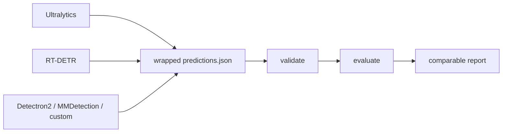

# YOLOZU (萬) — 日本語README

English: [`README.md`](README.md) | 中文: [`Readme_zh.md`](Readme_zh.md)

Official page: <https://www.toppymicros.com/yolozu/> | PyPI: <https://pypi.org/project/yolozu/> | Manual DOI: <https://doi.org/10.5281/zenodo.18744926>

## Evaluate existing predictions

YOLOZU は、既存の vision stack が出した predictions を評価するための Apache-2.0 evaluation layer です。

wrapped `predictions.json` を渡し、predictions interface contract を検証し、比較可能な report を作ります。

## 1分デモ

```bash
python3 -m pip install -U yolozu
yolozu doctor --proof
yolozu demo instance-seg --run-dir reports/quickstart_instance_seg --progress
```

出力: `reports/quickstart_instance_seg/instance_seg_demo_report.json`
可視化PNG: `reports/quickstart_instance_seg/overlays/`
対応するチェックリスト: `configs/quickstart/instance_seg_demo.yaml`
次に何を実行すればよいか迷ったら、CLI 内蔵の guide を使えます。

```bash
yolozu guide
yolozu guide --goal first-run
yolozu guide --goal evaluate
```



[](https://pypi.org/project/yolozu/)
[](https://pypi.org/project/yolozu/)
[](LICENSE)
[](https://github.com/ToppyMicroServices/YOLOZU/actions/workflows/build_and_test.yml)

## 最初に読む3本

- [`docs/README.md`](docs/README.md): docs 全体の入口と最短の使い方
- [`docs/predictions_schema.md`](docs/predictions_schema.md): predictions interface contract
- [`docs/install.md`](docs/install.md): install、`doctor`、環境確認

## Primary Focus

- Stable lane: 既存 predictions を framework / runtime をまたいで公平に評価すること
- Bridge lane: 同じ predictions interface contract を出す export / external training flow
- Benchmark lane: stable evaluation path が動いた後に backend parity を検証すること
- Research lane: continual learning、TTT、SynthGen、Hessian workflow は opt-in extension

## Capability Maturity

- Stable: prediction validation/evaluation、wrapped `predictions.json`、repo smoke/demo path、install/doctor
- Experimental: backend parity、benchmark orchestration、external training handoff、macOS/MPS evaluation path
- Research: continual learning、self-distillation、TTT、Hessian refinement

## Production Readiness

- いま production-ready と言いやすいもの: prediction validation/evaluation と predictions interface contract
- 環境ごとの検証が必要なもの: backend parity、benchmark orchestration、SynthGen handoff、macOS/MPS path
- research-oriented なもの: continual learning、self-distillation、TTT、Hessian refinement
- 詳細: [`docs/production_readiness.md`](docs/production_readiness.md)

## 向いているケース

- 既に predictions があり、framework をまたいで公平比較したい
- training stack はそのままに、Apache-2.0 の evaluation layer だけ導入したい
- framework-native evaluation の差を、そのまま比較結果に持ち込みたくない

## あまり向いていないケース

- one-click default の end-to-end training framework が欲しい
- cross-framework comparison や stable な predictions interface contract が不要

## Why not framework-native evaluation?

1つの framework の中だけなら framework-native evaluation は便利です。ただし stack をまたぐと比較条件がずれやすくなります。YOLOZU は評価境界を 1 つの predictions interface contract に固定し、inference 実装が変わっても比較経路を pinned に保ちます。

## 次に見る場所

- 既存 predictions を評価する: [`docs/external_inference.md`](docs/external_inference.md)
- train → export → eval を試す: [`docs/training_inference_export.md`](docs/training_inference_export.md)
- YOLO-style / Detectron2 external training lane（`yolozu train --external-backend yolox|detectron2|ultralytics|hf-detr ...`）: [`docs/training_inference_export.md`](docs/training_inference_export.md)
- 現在の training support matrix と scope 境界: [`docs/training_inference_export.md#current-training-support`](docs/training_inference_export.md#current-training-support)
- training backend interface / capability matrix / orchestration: [`docs/training_backend_interface.md`](docs/training_backend_interface.md), [`docs/training_capability_matrix.md`](docs/training_capability_matrix.md), [`docs/training_orchestration.md`](docs/training_orchestration.md)
- backend 比較や benchmark を見る: [`docs/backend_parity_matrix.md`](docs/backend_parity_matrix.md), [`docs/benchmark_mode.md`](docs/benchmark_mode.md), [`docs/benchmark_support_matrix.md`](docs/benchmark_support_matrix.md)
- YOLOZU-synthgen 連携を準備する: [`docs/synthgen_repo_integration.md`](docs/synthgen_repo_integration.md)
- tool / manifest の参照先: [`docs/tools_index.md`](docs/tools_index.md), [`tools/manifest.json`](tools/manifest.json)

## Secondary / Research lanes

- training、export、benchmark、SynthGen、research workflow は、この evaluation boundary に接続する secondary lane です。
- External training bridge: YOLOX first、optional Ultralytics / HF DETR bridges second
- SynthGen handoff: [`docs/synthgen_repo_integration.md`](docs/synthgen_repo_integration.md)
- Research workflow: [`docs/learning_features.md`](docs/learning_features.md)
- 実画像 showcase: [`docs/assets/readme_multitask_showcase.png`](docs/assets/readme_multitask_showcase.png)

## repo checkout で使う場合

```bash
python3 -m pip install -e .
bash scripts/smoke.sh
```

詳しくは次を見てください。

- docs index: [`docs/README.md`](docs/README.md)
- install 詳細: [`docs/install.md`](docs/install.md)
- manual source: [`manual/README.md`](manual/README.md)

## Support と License

- Support: [`docs/support.md`](docs/support.md)
- License policy: [`docs/license_policy.md`](docs/license_policy.md)
- External training boundary: YOLOX first, optional Ultralytics / HF DETR bridges second
- Apache-2.0 license: [`LICENSE`](LICENSE)
- Latest release: [GitHub Releases](https://github.com/ToppyMicroServices/YOLOZU/releases)
- Zenodo software DOI: [10.5281/zenodo.18744756](https://doi.org/10.5281/zenodo.18744756)
- Zenodo manual DOI: [10.5281/zenodo.18744926](https://doi.org/10.5281/zenodo.18744926)
