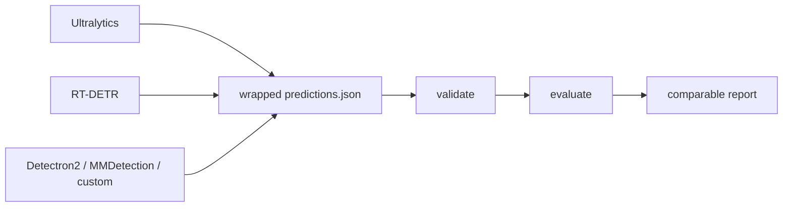

# YOLOZU (萬) - 日本語README

English: [`README.md`](README.md) | 中文: [`Readme_zh.md`](Readme_zh.md)

Company: [ToppyMicroServices OÜ](https://www.toppymicros.com/) | Official page: <https://www.toppymicros.com/yolozu/> | PyPI: <https://pypi.org/project/yolozu/> | Manual DOI: <https://doi.org/10.5281/zenodo.18744926>

## Evaluate existing predictions

YOLOZU は ToppyMicroServices OÜ が開発する商用プロダクトで、無料で提供しています。リポジトリのコードは Apache-2.0 でライセンスされています。

stable product lane では、stable predictions interface contract を通じて既存の vision predictions を検証し、公平に評価します。

wrapped `predictions.json` を渡し、predictions interface contract を検証し、比較可能な report を作ります。

標準 install での最短経路は、strict validation を内包する dry-run 1コマンドです。

```bash
yolozu eval-coco -d /path/to/dataset -p /path/to/predictions.json --dry-run -o reports/coco_eval.json
```

実際の COCO metrics には `yolozu[coco]` を install し、`--dry-run` を外します。

## 1分デモ

```bash
python3 -m pip install -U yolozu
yolozu doctor --proof
yolozu demo instance-seg --run-dir reports/quickstart_instance_seg --progress
```

出力: `reports/quickstart_instance_seg/instance_seg_demo_report.json`
可視化PNG: `reports/quickstart_instance_seg/overlays/`
対応するチェックリスト: `configs/quickstart/instance_seg_demo.yaml`
CPU-only の完全な DoD path（`doctor --proof -> demo -> validate -> eval`）は
[`docs/cpu_only_dod.md`](docs/cpu_only_dod.md) に固定しています。
次に何を実行すればよいか迷ったら、CLI 内蔵の guide を使えます。

```bash
yolozu guide
yolozu guide --goal first-run
yolozu guide --goal evaluate
```

## Python / AI から最短で使う

workflow を別の Python program が管理する場合は、typed in-process API を使えます。

```python
from pathlib import Path

from yolozu.api import evaluate_coco

result = evaluate_coco(
    dataset=Path("/absolute/path/to/dataset"),
    predictions=Path("/absolute/path/to/predictions.json"),
    dry_run=True,
)
print(result.to_dict())
```

AI client には、まず小さな guaranteed tool list だけを渡せます。

```bash
yolozu-mcp --print-tools --guaranteed --ids-only
```

typed error、workspace boundary、MCP setup、広い opt-in discovery は
[`docs/python_api.md`](docs/python_api.md) と
[`docs/ai_first.md`](docs/ai_first.md) を参照してください。

training 前には、空または不正な split を fail closed で検査し、train doctor
から machine-readable な readiness 判定を取得します。

```bash
yolozu validate dataset /path/to/yolo_dataset --split train --strict
yolozu doctor train-dataset --dataset /path/to/yolo_dataset --split train --output -
```

COCO annotation と画像を別々に指定する場合は、`--instances` と
`--images-dir` を併用します。この経路では `--dataset` は不要です。詳細は
[`docs/training_inference_export.md`](docs/training_inference_export.md) を参照してください。



[](https://pypi.org/project/yolozu/)
[](https://pypi.org/project/yolozu/)
[](LICENSE)
[](https://github.com/ToppyMicroServices/YOLOZU/actions/workflows/build_and_test.yml)

## 最初に読む3本

- [`docs/README.md`](docs/README.md): docs 全体の入口と最短の使い方
- [`docs/predictions_schema.md`](docs/predictions_schema.md): predictions interface contract
- [`docs/python_api.md`](docs/python_api.md): typed in-process validation/evaluation API と error policy
- [`docs/install.md`](docs/install.md): install、`doctor`、環境確認
- [`docs/byop_quickstarts.md`](docs/byop_quickstarts.md): Ultralytics、Detectron2、MMDetection、YOLOX から共通 report までの検査済み手順
- [`docs/case_studies/maskrcnn_eager_torchscript.md`](docs/case_studies/maskrcnn_eager_torchscript.md): eager / TorchScript の実出力を同じ評価経路で比較した再現可能な事例
- [検索可能な web docs](https://www.toppymicros.com/yolozu/docs/): 入力を先に生成する strict 30分 path、typed Python API、生成済み command/schema reference

## Primary Focus

- Stable lane: 既存 predictions を framework / runtime をまたいで公平に評価すること
- Bridge lane: 同じ predictions interface contract を出す export / external training flow
- Benchmark lane: stable evaluation path が動いた後に backend parity を検証すること
- Research lane: 評価済み artifact に対する opt-in workflow

## Capability Maturity

- Stable: prediction validation/evaluation、wrapped `predictions.json`、repo smoke/demo path、install/doctor
- Experimental: backend parity、benchmark orchestration、external training handoff、macOS/MPS evaluation path、TTA
- Research: continual learning、self-distillation、TTT、Hessian refinement

これは capability-level の境界です。Stable の親 CLI や manifest entry が opt-in の
subcommand/flag を昇格させるわけではありません。`export_predictions` では baseline
export は Stable、TTA は Experimental、TTT は Research のままです。

`tools/run_ttt_evidence_suite.py` で fail-closed な multi-seed の
clean/shift matrix を実行できます。生成された metric だけで Research lane
を昇格させることはありません。2026-07-27 の限定的な診断bundleは
[GitHub prerelease](https://github.com/ToppyMicroServices/YOLOZU/releases/tag/ttt-evidence-2026-07-27)
で公開しています。archive SHA-256 は
`bb200d0c0a36447f0b6ed262a56ee09bef44ded8f10c55673243080fe1054068` です。
これは efficacy や independent reproduction を示すものではありません。詳細は
[`docs/ttt_protocol.md`](docs/ttt_protocol.md)を参照してください。

## Production Readiness

- いま production-ready と言いやすいもの: prediction validation/evaluation と predictions interface contract
- 環境ごとの検証が必要なもの: backend parity、benchmark orchestration、SynthGen handoff、macOS/MPS path
- research-oriented なもの: continual learning、self-distillation、TTT、Hessian refinement
- 詳細: [`docs/production_readiness.md`](docs/production_readiness.md)

## 特に向いている3つのケース

- 同じ dataset と固定した evaluation protocol で、複数の framework / runtime の predictions を比較する
- 自社または third-party の vision stack が出した predictions を検証・wrap し、1つの evaluation path で評価する
- metric、preprocessing、backend の drift を検出する CI / regression report を追加する

## あまり向いていないケース

managed training platform、hosted inference service、保証付き support / SLA、または one-click production deployment が必要な場合、YOLOZU は最適ではありません。1つの framework 内だけで評価し、stable cross-stack boundary が不要なら、その framework-native evaluator の方が簡単です。training、benchmark、adapter、research capability は、stable product promise ではなく、検証条件付きの secondary lane です。

## Why not framework-native evaluation?

1つの framework の中だけなら framework-native evaluation は便利です。ただし stack をまたぐと比較条件がずれやすくなります。YOLOZU は評価境界を 1 つの predictions interface contract に固定し、inference 実装が変わっても比較経路を pinned に保ちます。

## 次に見る場所

- 既存 predictions を評価する: [`docs/external_inference.md`](docs/external_inference.md)
- 既存 model project から持ち込む: [`docs/byop_quickstarts.md`](docs/byop_quickstarts.md)
- train → export → eval を試す: [`docs/training_inference_export.md`](docs/training_inference_export.md)
- YOLO-style / Detectron2 external training lane（`yolozu train --external-backend yolox|detectron2|ultralytics|hf-detr ...`）: [`docs/training_inference_export.md`](docs/training_inference_export.md)
- 現在の training support matrix と scope 境界: [`docs/training_inference_export.md#current-training-support`](docs/training_inference_export.md#current-training-support)
- training backend interface / capability matrix / orchestration: [`docs/training_backend_interface.md`](docs/training_backend_interface.md), [`docs/training_capability_matrix.md`](docs/training_capability_matrix.md), [`docs/training_orchestration.md`](docs/training_orchestration.md)
- backend 比較や benchmark を見る: [`docs/backend_parity_matrix.md`](docs/backend_parity_matrix.md), [`docs/benchmark_mode.md`](docs/benchmark_mode.md), [`docs/benchmark_support_matrix.md`](docs/benchmark_support_matrix.md)
- 2つのruntimeを固定条件で比較した実証結果を見る: [`docs/case_studies/maskrcnn_eager_torchscript.md`](docs/case_studies/maskrcnn_eager_torchscript.md)
- YOLOZU-synthgen 連携を準備する: [`docs/synthgen_repo_integration.md`](docs/synthgen_repo_integration.md)
- tool / manifest の参照先: [`docs/tools_index.md`](docs/tools_index.md), [`tools/manifest.json`](tools/manifest.json)

## Secondary / Research lanes

- training、export、benchmark、SynthGen、research workflow は、この evaluation boundary に接続する secondary lane です。
- External training bridge: YOLOX first、optional Ultralytics / HF DETR bridges second
- SynthGen handoff: [`docs/synthgen_repo_integration.md`](docs/synthgen_repo_integration.md)
- Research workflow: [`docs/research_lanes.md`](docs/research_lanes.md)
- 実画像 showcase: [`docs/assets/readme_multitask_showcase.png`](docs/assets/readme_multitask_showcase.png)

## repo checkout で使う場合

```bash
python3 -m pip install -e .
bash scripts/smoke.sh
```

詳しくは次を見てください。

- docs index: [`docs/README.md`](docs/README.md)
- install 詳細: [`docs/install.md`](docs/install.md)
- manual source: [`manual/README.md`](manual/README.md)

## サポート、フィードバック、ライセンス

- 構造化された support / feedback: [`docs/support.md`](docs/support.md)
- License policy: [`docs/license_policy.md`](docs/license_policy.md)
- External training boundary: YOLOX first, optional Ultralytics / HF DETR bridges second
- Apache-2.0 license: [`LICENSE`](LICENSE)
- Latest release: [GitHub Releases](https://github.com/ToppyMicroServices/YOLOZU/releases)
- Zenodo software DOI: [10.5281/zenodo.18744756](https://doi.org/10.5281/zenodo.18744756)
- Zenodo manual DOI: [10.5281/zenodo.18744926](https://doi.org/10.5281/zenodo.18744926)
