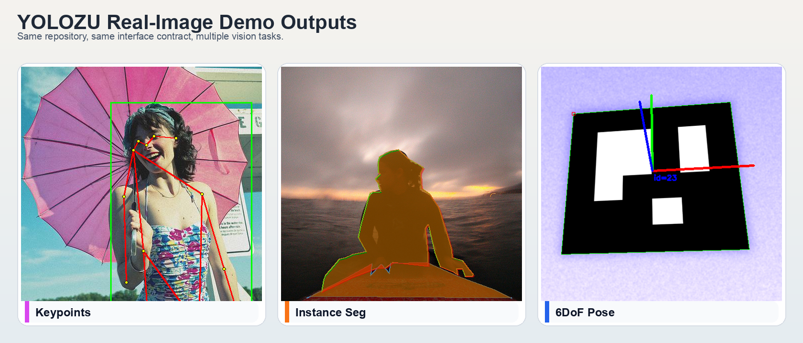

# YOLOZU (萬) — 中文 README

English README: [`README.md`](README.md) | 日本語README: [`Readme_jp.md`](Readme_jp.md)

[](https://pypi.org/project/yolozu/)
[](https://github.com/ToppyMicroServices/YOLOZU/releases/latest)
[](https://doi.org/10.5281/zenodo.18744756)
[](https://doi.org/10.5281/zenodo.18744926)
[](https://pypi.org/project/yolozu/)
[](LICENSE)
[](https://github.com/ToppyMicroServices/YOLOZU/actions/workflows/build_and_test.yml)
[](https://www.bestpractices.dev/projects/12216)
[](https://github.com/ToppyMicroServices/YOLOZU/actions/workflows/container.yml)
[-0A7A0A)](https://github.com/ToppyMicroServices/YOLOZU/actions/workflows/build_and_test.yml)
[](https://github.com/ToppyMicroServices/YOLOZU/actions/workflows/container.yml)

## 30 秒快速上手（pip）

**Predictions-first interface contract。** 先生成一次 `predictions.json`，之后就可以跨框架、跨后端执行一致的验证与评估。

```bash
python3 -m pip install -U yolozu
yolozu demo overview
```

输出位置：`demo_output/overview/<utc>/demo_overview_report.json`

如果 YOLOZU 帮你节省了时间，欢迎点个 Star，让更多人更容易找到它。

## Real-Image Showcase

下图来自仓库内置 demo 的真实图像输出，目的是先直观看到多任务结果，再回到同一套 predictions interface contract。



复现命令（真实图像推理；keypoints / instance segmentation 需要 `torch` + `torchvision`，pose 需要 `opencv-python` 或 `opencv-contrib-python`）：

```bash
python3 -m pip install -U 'yolozu[demo]'
yolozu demo keypoints
python3 scripts/download_coco_instances_tiny.py --out-root data/coco --split val2017 --num-images 8 --seed 0
yolozu demo instance-seg --background coco-instances --inference auto --num-images 1 --max-instances 8 --score-threshold 0.25
yolozu demo pose --backend aruco
```

## YOLOZU 概览

- **框架无关的视觉模型评估工具包**：面向域偏移（domain shift）场景下的持续学习与 test-time adaptation，强调可复现、可审计、可比较。
- **支持缓解灾难性遗忘的训练工作流**：提供 self-distillation、replay、PEFT 等训练/评估路径，用于量化并缓解遗忘，但不承诺彻底消除。
- **支持推理时适配（TTT）**：允许在推理阶段执行受控参数更新，以应对部署环境中的域偏移。
- **以 predictions 作为稳定的 interface contract**：核心不是具体模型对象，而是 `predictions.json` 及其协议化元数据，因此训练、持续学习、TTT、导出和 CI 回归都能对齐。
- **支持多任务评估**：覆盖 object detection、segmentation、keypoints、monocular depth、6DoF pose。
- **具备面向部署的导出路径**：支持 PyTorch、ONNX Runtime、TensorRT、ExecuTorch，并提供 C++ / Rust 参考推理模板。
- **AI-first / interface-contract-first 工作流**：每次实验都产出带版本的 artifact，便于 CI 自动比较与回归检测。

## 框架比较（同一数据集 + predictions interface contract）

YOLOZU 的核心价值，在于让不同模型栈基于 **同一数据集** 和稳定的 **predictions interface contract**（`predictions.json` + `export_settings`）进行可复现、可比较的评估。

| Model / stack | Fine-tune entrypoint (smoke) | `predictions.json` export path | Eval path | Notes |
| --- | --- | --- | --- | --- |
| Ultralytics YOLO (YOLOv8/YOLO11) | `tools/run_external_finetune_smoke.py` (framework=`yolov`) | `tools/export_predictions_ultralytics.py` | `tools/eval_coco.py` | Typical exports are post-NMS; use `protocol=nms_applied`. |
| RT-DETR (in-repo `rtdetr_pose`) | `tools/run_external_finetune_smoke.py` (framework=`rtdetr`) | `tools/run_reference_adapter_regression.py` (predict→canonicalize) | `tools/run_reference_adapter_regression.py` (gates) | Reference adapter regression is the “real model baseline” path. |
| Hugging Face DETR / RT-DETR | `tools/support_ultralytics_detr.py th` (dry/non-dry) | `tools/support_ultralytics_detr.py pn` (normalize) | `tools/eval_coco.py` | Keeps framework specifics outside the stable interface contract. |
| Detectron2 | `tools/run_external_finetune_smoke.py` (framework=`detectron2`) | `tools/export_predictions_detectron2.py` | `tools/eval_coco.py` | Non-dry execution requires `--detectron2-train-script`. |
| MMDetection | `tools/run_external_finetune_smoke.py` (framework=`mmdetection`) | `tools/export_predictions_mmdet.py` | `tools/eval_coco.py` | Non-dry execution requires `--mmdet-train-script`. |
| YOLOX | (interop smoke) | `tools/yolozu.py export --backend yolox` | `tools/eval_coco.py` | Intended for “external inference → interface contract → eval” workflows. |

最小验证（同一数据、同一报告形状，默认 dry-run）：

```bash
python3 tools/run_external_finetune_smoke.py --dataset-root data/smoke --split train --output reports/external_finetune_smoke.json
```

## Quickstart（源码 checkout 后先运行）

```bash
python3 -m pip install -e .
bash scripts/smoke.sh
```

版本变更说明可参考 [GitHub Release notes](https://github.com/ToppyMicroServices/YOLOZU/releases)。

如果系统 Python 启用了 PEP 668（externally managed），请使用虚拟环境：

```bash
python3 -m venv .venv
source .venv/bin/activate
python -m pip install -U pip
python -m pip install -e .
bash scripts/smoke.sh
```

主要输出：

- `reports/smoke_coco_eval_dry_run.json`
- `reports/smoke_synthgen_summary.json`
- `reports/smoke_synthgen_eval.json`
- `reports/smoke_synthgen_overlay.png`
- `reports/smoke_demo_instance_seg/overlays/*.png`

如果你只想执行 interface contract 检查，而不生成 demo PNG：

```bash
bash scripts/smoke.sh --skip-demo
```

如果你希望执行更完整的首次验证流程（能力项检查 + deploy-path dry-run）：

```bash
bash scripts/smoke.sh --profile deep
```

在 CUDA 单卡机器上，也可以把 deep profile 中的 TTT probe 放到 GPU 上：

```bash
bash scripts/smoke.sh --profile deep --torch-device cuda
```

deep profile 的额外产出：

- `reports/smoke_walkthrough_report.json`
- `reports/smoke_demo_overview.json`
- `reports/smoke_external_finetune_report.json`
- `reports/smoke_export_{onnxrt,trt,executorch}.json`

文档入口：[`docs/README.md`](docs/README.md)

AI-friendly 工具注册表（source of truth）：[`tools/manifest.json`](tools/manifest.json)

工具列表与参数示例：[`docs/tools_index.md`](docs/tools_index.md)

学习 / 持续学习 / TTT / distillation / long-tail 配方：[`docs/learning_features.md`](docs/learning_features.md)

## 从这里开始（4 个入口）

- **A: 从已有 predictions 开始评估**：`predictions.json` → validate → eval
- **B: 训练 → 导出 → 评估**：RT-DETR scaffold + run interface contract / Run Contract
- **C: interface contract 本身**：predictions / adapter / TTT protocol
- **D: parity / benchmark**：TensorRT、latency benchmark、backend drift

以上四条路径都在 [`docs/README.md`](docs/README.md) 中提供了可直接复制的命令。

CLI 说明：

- `yolozu ...` 是 pip 安装后的 package CLI
- `python3 tools/yolozu.py ...` 是 repo wrapper CLI
- 两者等价时，通常只需替换可执行入口（`yolozu` ↔ `python3 tools/yolozu.py`）

模块路径说明：

- canonical Python 模块位于分类后的包路径下（`yolozu/core`, `yolozu/datasets`, `yolozu/eval`, `yolozu/inference`, `yolozu/predictions`, `yolozu/training`, `yolozu/geometry`）
- 历史 import（例如 `from yolozu.dataset import build_manifest`）通过 `yolozu/__init__.py` 中的 alias 保持兼容

## 关键点

- 无论使用仓内推理还是外部推理，只要最终落到稳定的 `predictions.json` interface contract，就可以纳入统一评估流程
- validator 会尽早发现 schema drift
- protocol-pinned `export_settings` 使比较结果具备可复现性
- parity / benchmark 用于量化 backend drift 与性能差异
- `yolozu benchmark` 提供了更接近 Ultralytics 的 benchmark 入口；在条件满足时可实际编排 `torch` / `onnx` / `engine`，并为这些 backend 比较生成真实 parity artifact；报告中会显式记录 `detect` / `segmentation` / `classification` / `obb` / `keypoints` / `depth` / `pose6d` 的 task semantics；对于当前实现无法真正生效的 format/flag 组合会提前报错；`torchscript` 目前以诚实的 synthetic/skip 语义纳入统一报告，并明确区分外部 runtime 边界
- 默认对 CPU 友好，GPU 为可选增强
- repo 工具链遵循 Apache-2.0-only 的运维策略

## 为什么选择 YOLOZU

YOLOZU 围绕 predictions-first interface contract 标准化评估流程：你可以在任意框架、任意运行时执行推理，导出 `predictions.json`（以及 `export_settings`），再依据固定协议完成验证与评估，从而获得可横向比较的实验结果。

详情：[`docs/yolozu_spec.md`](docs/yolozu_spec.md)

## 安装（pip 用户）

```bash
python3 -m pip install yolozu
yolozu --help
yolozu doctor --output -
```

可选（CPU）demo：

```bash
python3 -m pip install -U 'yolozu[demo]'
yolozu demo overview
yolozu demo
yolozu demo instance-seg
yolozu demo keypoints
yolozu demo pose
yolozu demo pose --backend aruco
yolozu demo pose --backend densefusion
yolozu demo depth
yolozu demo train
yolozu demo continual --compare --markdown
```

首次可视确认（确认 PNG 确实生成）：

```bash
yolozu demo instance-seg --background yolo-bbox --yolo-root data/smoke --yolo-split val --inference none --num-images 2 --max-instances 2 --run-dir reports/demo_firsttime_instance_seg
ls reports/demo_firsttime_instance_seg/overlays/*.png
```

更多可选依赖与 CPU demo 说明：[`docs/install.md`](docs/install.md)

CLI 补全（bash/zsh）：

```bash
# bash
eval "$(yolozu completion --shell bash)"
# zsh
eval "$(yolozu completion --shell zsh)"
```

真实图像 multitask finetune smoke（bbox / segmentation / keypoints / depth / pose6d）：

```bash
python3 scripts/download_coco_instances_tiny.py --out-root data/coco --split val2017 --num-images 8 --seed 0 --force
python3 tools/prepare_real_multitask_fewshot.py --out data/real_multitask_fewshot --train-images 6 --val-images 2 --strict-provenance --force
python3 tools/run_real_multitask_finetune_demo.py --dataset-root data/real_multitask_fewshot --out reports/real_multitask_finetune_demo --device cpu --epochs 1 --max-steps 1 --batch-size 2 --image-size 96 --strict-provenance --force
```

一条命令执行完整流程（prepare + 可选 tiny COCO 自动下载 + staged smoke）：

```bash
python3 tools/run_real_multitask_finetune_demo.py --dataset-root data/real_multitask_fewshot --prepare --download-if-missing --allow-auto-download --accept-dataset-license --download-num-images 8 --out reports/real_multitask_finetune_demo --device cpu --epochs 1 --max-steps 1 --batch-size 2 --image-size 96 --strict-provenance --force
```

外部 finetune smoke 矩阵（YOLOv / MMDetection / Detectron2 / RT-DETR）：

```bash
python3 tools/run_external_finetune_smoke.py --dataset-root data/smoke --split train --output reports/external_finetune_smoke.json
```

运行真实训练（指定框架）：

```bash
python3 tools/run_external_finetune_smoke.py --dataset-root data/smoke --split train --non-dry-framework yolov --non-dry-framework rtdetr --epochs 1 --max-steps 1 --batch-size 2 --image-size 96 --device cpu --require-training-execution --output reports/external_finetune_smoke.exec.json
```

详情：[`docs/external_finetune_smoke.md`](docs/external_finetune_smoke.md)

用于 TTT 的 deterministic domain-shift target recipe：

```bash
python3 scripts/prepare_ttt_domain_shift_target.py --dataset-root data/smoke --split val --out reports/domain_shift/smoke_gaussian_blur_s2 --corruption gaussian_blur --severity 2 --seed 2026 --force
python3 tools/export_predictions.py --adapter dummy --dataset reports/domain_shift/smoke_gaussian_blur_s2 --split val --wrap --domain-shift-recipe reports/domain_shift/smoke_gaussian_blur_s2/domain_shift_recipe.json --output reports/pred_shift_target.json
```

详情：[`docs/ttt_protocol.md`](docs/ttt_protocol.md)

TTT improvement micro-demo（展示 metric delta 与 overlay）：

```bash
python3 -m pip install -U 'yolozu[demo]'
yolozu demo ttt
```

输出：

- `demo_output/ttt/<utc>/overlay_no_ttt.png`
- `demo_output/ttt/<utc>/overlay_ttt.png`
- `demo_output/ttt/<utc>/ttt_improvement_report.json`

Reference adapter regression（RT-DETR，真实模型基线）：

```bash
python3 tools/run_reference_adapter_regression.py --dataset data/smoke --split val --max-images 2 --profile micro --repro-policy relaxed --runtime-lock requirements-ci.lock --baseline baselines/reference_adapter/rtdetr_pose_smoke_val.json --diff-summary-out reports/reference_adapter_regression.diff_summary.json --topk-examples-dir reports/reference_adapter_regression_topk --topk-examples 3 --output reports/reference_adapter_regression.json
```

仅执行 interface contract hard gate：

```bash
python3 tools/run_reference_adapter_regression.py --dataset data/smoke --split val --max-images 2 --profile micro --score-gate-mode off --perf-gate-mode off --runtime-lock requirements-ci.lock --enforce-runtime-lock --enforce-weights-hash --baseline baselines/reference_adapter/rtdetr_pose_smoke_val.json --output reports/reference_adapter_regression_contract.json
```

仅执行 behavior warn gate：

```bash
python3 tools/run_reference_adapter_regression.py --dataset data/smoke --split val --max-images 2 --profile micro --schema-gate-mode off --consistency-gate-mode off --score-gate-mode warn --perf-gate-mode warn --runtime-lock requirements-ci.lock --enforce-runtime-lock --baseline baselines/reference_adapter/rtdetr_pose_smoke_val.json --output reports/reference_adapter_regression_behavior.json
```

## 源码 checkout（repo 用户）

```bash
python3 -m pip install -r requirements-test.txt
python3 -m pip install -r requirements-ci.lock
python3 -m pip install -e .
python3 tools/yolozu.py --help
python3 -m unittest -q
```

如果你是在源码 checkout 环境中补装 demo 依赖：

```bash
python3 -m pip install -e '.[demo]'
```

单命令 release 自动化：

```bash
bash release.sh
```

dry-run 预览：

```bash
bash release.sh --dry-run --allow-dirty --allow-non-main --output reports/release_report.dry_run.json
```

MCP 设置检查（manifest + 生成后的 MCP / Actions 参考）：

```bash
python3 tools/check_mcp_settings.py --output reports/mcp_settings_check.json
```

Ultralytics / DETR 支持层：

```bash
python3 tools/support_ultralytics_detr.py ls -j
python3 tools/support_ultralytics_detr.py tu -P smoke -n -o reports/support_ultralytics_detr.train_ultralytics.json
python3 tools/support_ultralytics_detr.py th -P smoke -n -o reports/support_ultralytics_detr.train_hf_detr.json
python3 tools/support_ultralytics_detr.py eo -P smoke -o models/yolo11n.onnx -n -r reports/support_ultralytics_detr.export_onnx.json
```

详见：[`docs/ultralytics_detr_support.md`](docs/ultralytics_detr_support.md)

## Manual（PDF）

可打印的 manual 源码：[`manual/`](manual/README.md)

## 支持 / 法务

- Contact: develop@toppymicros.com
- © 2026 ToppyMicroServices OÜ

完整支持与法务说明：[`docs/support.md`](docs/support.md)

## License

本仓库代码采用 Apache License 2.0。详见 `LICENSE`。
