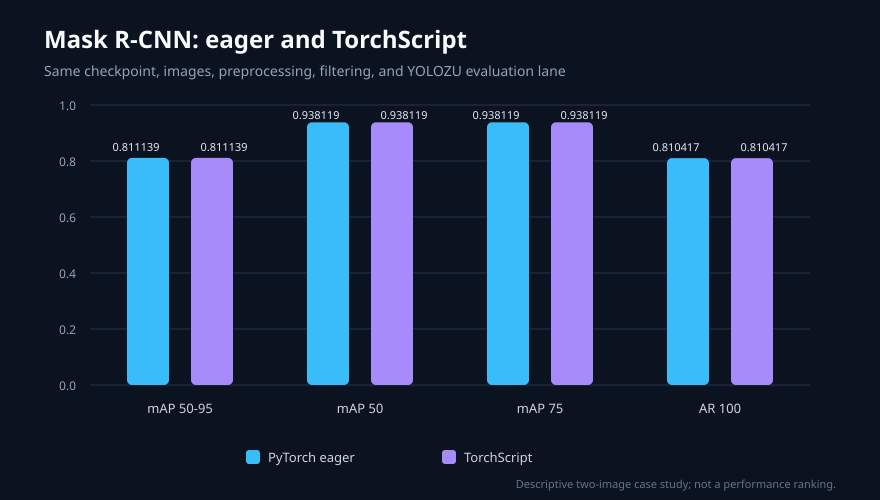

# Reproducible runtime comparison: Mask R-CNN eager vs TorchScript

This case study shows the narrow comparison YOLOZU is designed to make:
two real runtime outputs are converted to the same predictions interface contract
and evaluated with the same pinned conditions. It is not a model-quality benchmark
and does not claim that one runtime is faster or better.

## Confirmed setup

- Model: Torchvision `maskrcnn_resnet50_fpn_v2`
- Checkpoint:
  `MaskRCNN_ResNet50_FPN_V2_Weights.COCO_V1`
- Checkpoint SHA-256:
  `73cbd0190fcbe3ba339921fbce2c3a0b6bb9126c9a133c85e43a2a8e060a109e`
- Compared runtime paths: PyTorch eager and `torch.jit.script`
- Inputs: the first two deterministically ordered `data/smoke` validation
  images and their labels
- Class mapping: `labels/val/classes.json` must match the standard contiguous
  COCO80 name order and sparse COCO category IDs
- Device: CPU, one thread
- Export filter: score at least `0.5`, at most `20` detections per image
- Evaluation: YOLOZU's stable `eval-coco` lane with `cxcywh_norm` boxes,
  split `val`, and the same two-image bound

The exact embedded model transform, model-side NMS settings, input hashes, and
export settings are recorded in
[`protocol.json`](../assets/case_studies/maskrcnn_eager_torchscript/protocol.json).
No named YOLOZU COCO protocol preset is claimed: Torchvision's embedded
`GeneralizedRCNNTransform` is not the 640-pixel letterbox transform pinned by
those presets.

## Observed result

Both runtime paths executed real inference. Each retained 12 detections. The
strict parity report matched every retained eager detection to the TorchScript
output with no score or box failure at the recorded tolerances.

| Metric | PyTorch eager | TorchScript | Difference |
| --- | ---: | ---: | ---: |
| mAP 50–95 | 0.8111386139 | 0.8111386139 | 0 |
| mAP 50 | 0.9381188119 | 0.9381188119 | 0 |
| mAP 75 | 0.9381188119 | 0.9381188119 | 0 |
| AR 100 | 0.8104166667 | 0.8104166667 | 0 |



The result demonstrates output stability for this checkpoint, input subset,
environment, and protocol. The two-image smoke subset is too small to support
a general model-quality conclusion. Recorded single-run inference times are
environment observations only and are not used as a runtime ranking.

## Evidence

- Wrapped predictions:
  [`predictions_eager.json`](../assets/case_studies/maskrcnn_eager_torchscript/predictions_eager.json),
  [`predictions_torchscript.json`](../assets/case_studies/maskrcnn_eager_torchscript/predictions_torchscript.json)
- Stable evaluation reports:
  [`eval_eager.json`](../assets/case_studies/maskrcnn_eager_torchscript/eval_eager.json),
  [`eval_torchscript.json`](../assets/case_studies/maskrcnn_eager_torchscript/eval_torchscript.json)
- Detection-level comparison:
  [`parity.json`](../assets/case_studies/maskrcnn_eager_torchscript/parity.json)
- Conditions and environment:
  [`protocol.json`](../assets/case_studies/maskrcnn_eager_torchscript/protocol.json),
  [`environment.json`](../assets/case_studies/maskrcnn_eager_torchscript/environment.json)
- Machine-readable summary and commands:
  [`summary.json`](../assets/case_studies/maskrcnn_eager_torchscript/summary.json),
  [`commands.json`](../assets/case_studies/maskrcnn_eager_torchscript/commands.json)
- Integrity list:
  [`checksums.sha256`](../assets/case_studies/maskrcnn_eager_torchscript/checksums.sha256)

Verify the committed evidence from the repository root:

```bash
python3 tools/validate_predictions.py \
  docs/assets/case_studies/maskrcnn_eager_torchscript/predictions_eager.json \
  --strict
python3 tools/validate_predictions.py \
  docs/assets/case_studies/maskrcnn_eager_torchscript/predictions_torchscript.json \
  --strict
(
  cd docs/assets/case_studies/maskrcnn_eager_torchscript
  shasum -a 256 -c checksums.sha256
)
```

## Reproduce from a clean source tree

Use Python 3.12 and a new virtual environment. The recorded separate clean run
used Python 3.12.13, Torch 2.10.0, Torchvision 0.25.0, Pillow 12.2.0,
NumPy 2.4.4, and pycocotools 2.0.11; the exact executed environment remains
recorded in
[`environment.json`](../assets/case_studies/maskrcnn_eager_torchscript/environment.json).
The hard environment comparison uses the Python major/minor version, the
public release versions of those dependencies (ignoring local suffixes such as
`+cpu`), and the recorded Torch device, thread, and deterministic settings.
OS release, machine, processor, and Python patch version remain provenance but
are not hard equality conditions.
The first install command pins the CPU runtime pair and the second installs the
current source plus the COCO evaluator.

```bash
python3.12 -m venv .venv-case-study
.venv-case-study/bin/python -m pip install \
  --index-url https://download.pytorch.org/whl/cpu \
  torch==2.10.0 torchvision==0.25.0
.venv-case-study/bin/python -m pip install ".[coco]"

.venv-case-study/bin/python \
  tools/generate_runtime_parity_case_study.py \
  --dataset data/smoke \
  --split val \
  --max-images 2 \
  --score-threshold 0.5 \
  --max-detections 20 \
  --seed 2026 \
  --threads 1 \
  --allow-download \
  --expected-weights-sha256 \
    73cbd0190fcbe3ba339921fbce2c3a0b6bb9126c9a133c85e43a2a8e060a109e \
  --output-dir /tmp/yolozu-maskrcnn-runtime-reproduction \
  --baseline-dir \
    docs/assets/case_studies/maskrcnn_eager_torchscript \
  --metric-atol 1e-8
```

The command exits non-zero if the baseline checksum set is incomplete or
invalid, the candidate source tree is dirty, or the case ID, input/checkpoint
identity, protocol, normalized environment, source file hashes, parity
identity, exported prediction hashes, retained detection counts, parity
result, or metrics do not reproduce. Its comparison is written to
`/tmp/yolozu-maskrcnn-runtime-reproduction/reproduction_check.json`.
The checked-in
[`reproduction_check.json`](../assets/case_studies/maskrcnn_eager_torchscript/reproduction_check.json)
records the separate clean run performed for this publication.

If `--output-dir` already contains a case-study bundle and `--baseline-dir` is
omitted, the generator uses that existing bundle as an implicit baseline. It
publishes the staged candidate only after the same reproduction checks pass;
otherwise it exits non-zero and preserves the existing bundle. An explicit
`--baseline-dir` may equal `--output-dir` because generation occurs in a
separate staging directory.

## Boundaries

- The repository smoke images retain the provenance and license notice in
  [`data/smoke/README.md`](../../data/smoke/README.md).
- The checkpoint is referenced by official URL and hash; it is not
  redistributed in this repository.
- This comparison controls runtime conversion while holding the model,
  checkpoint, images, preprocessing, postprocessing, and evaluator constant.
  It does not compare different model families or training procedures.
- A change to any recorded input hash, checkpoint hash, preprocessing setting,
  filtering threshold, runtime version, or metric requires a new case-study
  version rather than silently replacing this result. The implicit-baseline
  check prevents the documented default command from silently overwriting a
  different result.
