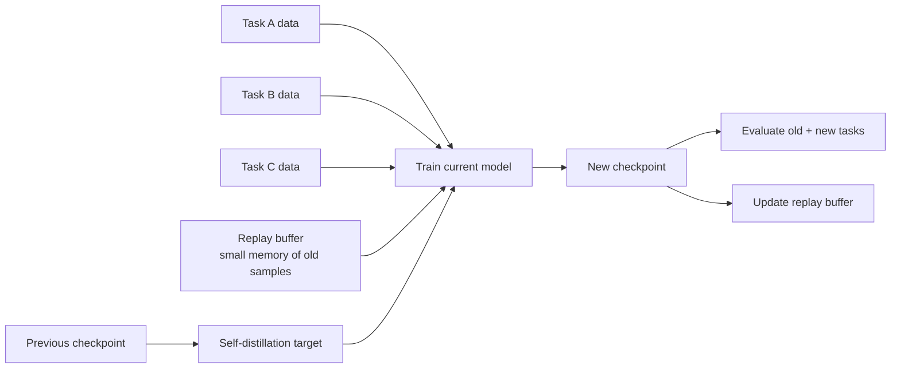
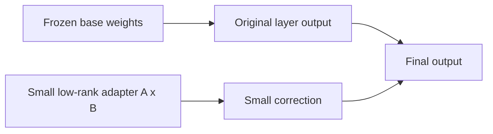
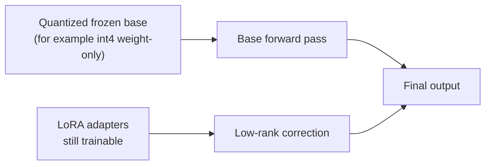

# Continual learning (anti-forgetting) for `rtdetr_pose`

This repo supports **continual fine-tuning** on multiple datasets/tasks while mitigating catastrophic forgetting.
This is a research-oriented lane in YOLOZU: use it with explicit evaluation and promotion gates, not as the default production lane.
See [`research_lanes.md`](research_lanes.md) and [`production_readiness.md`](production_readiness.md).

Continual learning is **opt-in**. It is not enabled by YOLOZU's default validation, evaluation, demo, or export commands, and a candidate checkpoint should not be promoted without `continual_eval.json` plus an explicit promotion decision report.

The baseline strategy is:

- **Memoryless**: self-distillation from the previous checkpoint (`--self-distill-from`) so the new model stays close to the old one (an SDFT-style checkpoint regularizer; reverse-KL on logits by default).
- **Memory**: add a small **replay buffer** (default 50 images, reservoir sampling) and train on *(current task + replay)* while also self-distilling.
- Optional: **LoRA** to restrict trainable parameters (parameter-efficient continual fine-tuning).

## Continual learning in one picture



The plain-language version is:

- new data keeps arriving
- we still want the model to remember older tasks
- so we do not let the new training run completely forget the previous checkpoint
- and we optionally keep a small memory of older examples

## LoRA and QLoRA in plain language

Many readers first meet continual learning and LoRA at the same time, so it helps to separate the ideas.

- **Continual learning** answers: "How do we keep learning new tasks without erasing old ones?"
- **LoRA / QLoRA** answer: "How do we make those updates smaller, cheaper, and easier to control?"

### LoRA in one picture



LoRA is easiest to understand as:

- keep the large pretrained model mostly unchanged
- attach a much smaller trainable correction
- learn that correction instead of rewriting the whole network

That is useful in continual learning because a smaller trainable surface often makes forgetting easier to control.

### What actually gets updated in LoRA

This is the part many readers want spelled out clearly:

- the large base weights are usually frozen
- the trainable update lives in small low-rank matrices attached to selected layers
- the effective weight can be read as:

$$
W' = W + \Delta W,\qquad \Delta W = B A
$$

- `W` is the frozen pretrained weight
- `A` and `B` are the small trainable adapter matrices

So the practical interpretation is:

- the model still uses the old backbone knowledge
- but each adapted layer gets a small learnable correction
- in continual learning, this means the update surface is narrower than full fine-tuning

That is why people often say LoRA is easier to control:

- fewer parameters move
- the old checkpoint remains a stronger anchor
- replay and self-distillation are not replaced; LoRA just changes how the new update is expressed

### QLoRA in one picture



QLoRA keeps the same basic idea as LoRA, but makes the frozen base cheaper to hold in memory.

In this repo, `--qlora` is a convenience path:

- it requires `--lora-r > 0`
- it forces base freezing
- it requests the `torchao` int4 weight-only path when available

So the short intuition is:

- **LoRA**: freeze most of the model, train a small adapter
- **QLoRA**: do the same thing, but keep the frozen base in a cheaper quantized form

Operationally, the update logic is still LoRA-style:

- adapters move
- the frozen base remains the reference
- quantization changes storage/runtime cost, not the anti-forgetting objective

### When each one is attractive

LoRA is a good default when:

- you want a simpler mental model
- you want easier debugging
- you do not need to squeeze memory aggressively

QLoRA is attractive when:

- memory pressure is the main problem
- you already accept an experimental quantized training path
- you want a smaller hardware footprint while keeping adapter-style updates

### A practical choice example

Suppose we are doing domain-incremental training over three warehouse camera domains:

- the base checkpoint already works reasonably well
- we mainly want to avoid forgetting older camera views
- our GPU memory budget is limited, but not extreme

In that case, a good first decision is:

- start with **LoRA**
- keep replay + self-distillation enabled
- get a stable baseline first

Why?

- LoRA is easier to debug
- if forgetting increases, we can more easily tell whether the issue is the continual-learning setup or the adapter size/config
- it removes one layer of quantization-related uncertainty

Now imagine the same workload, but:

- the model barely fits in memory
- batch size is collapsing
- the frozen base dominates the memory footprint

That is the point where **QLoRA** becomes attractive:

- we keep the same adapter-style update logic
- but we ask the frozen base to consume less memory

So a practical rule is:

- **LoRA first when clarity matters**
- **QLoRA when memory is the real blocker**

### Pros / Cons

**LoRA**

Pros:

- easier to reason about than full fine-tuning
- usually cheaper than updating all parameters
- often plays well with replay and self-distillation

Cons:

- still adds another set of knobs (`r`, `alpha`, `dropout`, target modules)
- can underfit if the adapter is too small
- can hide the fact that the base model, not the adapter, is the real bottleneck

**QLoRA**

Pros:

- pushes memory use down further
- keeps the same adapter-style workflow
- useful when the full frozen base is the memory bottleneck

Cons:

- more moving parts than plain LoRA
- depends on quantization backend support
- in practice, this repo treats the quantized path as more experimental than plain LoRA

## Method boundary and current literature

YOLOZU's implementation distills detector logits and boxes from the previous
checkpoint. It is not a faithful implementation of the
demonstration-conditioned, on-policy language-model procedure introduced in
“Self-Distillation Enables Continual Learning.” The shared idea is
self-distillation for retention; the data construction, model family, and
objective are different. Results from the paper therefore cannot be transferred
to this detector lane without direct evidence.

The repository also does not treat a low forgetting number alone as efficacy:
old-task retention, new-task adaptation, BWT, baseline-relative FWT, runtime,
memory, and repeated-seed behavior must be read together.

## References (self-distillation background)

This repo’s checkpoint-based self-distillation is a pragmatic anti-forgetting regularizer; it is not intended as a faithful reproduction of any single paper.

- Knowledge distillation (original): Hinton et al., “Distilling the Knowledge in a Neural Network” (arXiv:1503.02531)
  - https://arxiv.org/abs/1503.02531
- Self-distillation (classic reference): Furlanello et al., “Born Again Neural Networks” (arXiv:1805.04770)
  - https://arxiv.org/abs/1805.04770
- Continual learning via self-distillation: “Self-Distillation Enables Continual Learning” (arXiv:2601.19897)
  - https://arxiv.org/abs/2601.19897

## 0-minute start (pip users; CPU)

If you want to **see continual-learning behavior** (domain shift + forgetting mitigation) without downloading datasets:

```bash
python3 -m pip install 'yolozu[demo]'
yolozu demo continual --compare --markdown
```

This is a **toy synthetic** demo (not an image model). For real continual fine-tuning on image datasets, use the `rtdetr_pose` workflow below.

## One-command qualification

The shortest repository-tracked image-model comparison is:

```bash
./.venv/bin/python tools/qualify_sdft_continual.py \
  --output-dir /tmp/yolozu-sdft-qualification
```

It generates one deterministic Gaussian-blur target, builds one initial
checkpoint per seed, runs naive and checkpoint-distillation sequences for seeds
11/22/33 with identical data/order/budget, evaluates every matrix cell through
real `pycocotools` COCOeval, emits promotion decisions, and creates a checksum
archive. Both `--output-dir` and the archive must be new paths.

The machine-readable entrypoint is
`<output-dir>/qualification_summary.json`, defined by
[`schemas/sdft_continual_qualification.schema.json`](schemas/sdft_continual_qualification.schema.json).
This makes the result consumable by scripts and agents without parsing console
text. The bounded COCO128 blur sequence is diagnostic evidence, not an external
benchmark or production promotion.

### Recorded 2026-07-28 result

The clean three-seed execution completed every real-COCOeval matrix cell, but
all task scores and all SDFT-minus-naive deltas were zero. The decision is
therefore `hold`, and efficacy is `not_established`. Zero forgetting/BWT/FWT in
this run is not a positive result because the corresponding task scores were
also zero. The hash-verified bundle and exact environment, timing, memory, and
fairness observations are recorded in the
[evidence report](../reports/sdft_continual_evidence_2026-07-28.md) and
[GitHub prerelease](https://github.com/ToppyMicroServices/YOLOZU/releases/tag/sdft-evidence-2026-07-28).
The bundle was independently reproduced in a clean Python 3.12 environment on
2026-07-30 with matching semantic results. A non-zero positive
retention/adaptation trade-off remains required for promotion.

### Confirmatory non-zero qualification (2026-07-30)

The confirmatory spec increases initial training to 64 steps for 10 epochs,
uses 20 continual steps per task, and fixes unused seeds 44, 55, and 66.
Before execution it requires source and target task scores of at least
`1e-6`, non-decreasing new-task performance within `1e-6`, and a strictly
positive old-task SDFT-minus-naive delta for every seed.

All six runs produced non-zero source and target scores. Seeds 44 and 55 passed
the retention/adaptation checks, but seed 66 had an old-task delta of
`-7.100043986321695e-7` and failed the preregistered strict-retention gate.
The protocol and gate outcomes were independently reproduced. Reproduction is
therefore established for this bounded result, while efficacy remains
`not_established` and the decision remains `hold`. See the
[confirmatory evidence report](../reports/sdft_confirmatory_evidence_2026-07-30.md).

Run the fixed confirmatory spec explicitly:

```bash
./.venv/bin/python tools/qualify_sdft_continual.py \
  --spec configs/continual/sdft_coco128_blur_confirmatory_qualification.json \
  --output-dir /tmp/yolozu-sdft-confirmatory
```

An independent run must use a fresh output path and the primary summary:

```bash
./.venv/bin/python tools/qualify_sdft_continual.py \
  --spec configs/continual/sdft_coco128_blur_confirmatory_qualification.json \
  --output-dir /tmp/yolozu-sdft-confirmatory-independent \
  --role independent \
  --source-summary /tmp/yolozu-sdft-confirmatory/qualification_summary.json
```

## Quick start (domain-incremental)

1) Create a continual config (start from the example):

- `configs/continual/rtdetr_pose_domain_inc_example.yaml`

2) Run continual fine-tuning from an explicit initial checkpoint:

```bash
python3 rtdetr_pose/tools/train_continual.py \
  --config configs/continual/rtdetr_pose_domain_inc_example.yaml \
  --initial-checkpoint runs/initial/checkpoint.pt
```

To run **memoryless**, set `continual.replay_size: 0` in the config (or pass `--replay-size 0`).

3) Evaluate with real COCOeval and baseline-relative FWT:

```bash
python3 tools/eval_continual.py \
  --run-json runs/continual/<run>/continual_run.json \
  --device cpu \
  --metric coco \
  --metric-key map50_95 \
  --max-images 50
```

`--metric coco` requires `pycocotools`. `simple_map` remains a lightweight
proxy for wiring checks; it is not used by the qualification command.

Summary definitions follow the task matrix convention:

- average accuracy: final score averaged over all tasks
- forgetting: best prior score minus final score, averaged over tasks that had a later task
- BWT: final score minus the score immediately after learning that prior task
- FWT: score immediately before learning a future task minus that task's explicit initial-checkpoint baseline

FWT is `null` when neither `--baseline-checkpoint` nor
`continual_run.json.initial_checkpoint` is available. A raw pre-training score
is retained in `summary.details`, but it is not mislabeled as FWT.

On macOS, you can switch `--device` to `mps` when `yolozu doctor --output -` reports `runtime_capabilities.torch.mps_available: true`. In other words, MPS is supported when `torch.backends.mps.is_available()` is `true`. If MPS is not available on that machine, use `cpu`.

Pose/depth metrics (requires pose sidecar metadata in `labels/<split>/*.json`):

```bash
python3 tools/eval_continual.py \
  --run-json runs/continual/<run>/continual_run.json \
  --device cpu \
  --max-images 50 \
  --metric pose \
  --metric-key pose_success
```

Pose mode supports these `--metric-key` values:
- `pose_success`, `rot_success`, `trans_success`, `match_rate`, `iou_mean`
- `depth_abs_mean`, `depth_abs_median`
- `add_mean`, `add_median`, `adds_mean`, `adds_median`

Notes:
- `depth_abs_*` requires GT depth (`t_gt`) plus predicted depth/translation fields.
- `add*`/`adds*` require CAD points in sidecar metadata (`cad_points` / `cad_path` / `cad_points_path`) and valid GT+pred pose.

Examples for metric-key switching:

```bash
# depth error summary
python3 tools/eval_continual.py \
  --run-json runs/continual/<run>/continual_run.json \
  --metric pose \
  --metric-key depth_abs_mean

# ADD / ADDS (requires CAD points)
python3 tools/eval_continual.py \
  --run-json runs/continual/<run>/continual_run.json \
  --metric pose \
  --metric-key add_mean

python3 tools/eval_continual.py \
  --run-json runs/continual/<run>/continual_run.json \
  --metric pose \
  --metric-key adds_mean
```

This writes:
- `runs/continual/<run>/continual_eval.json`
- `runs/continual/<run>/continual_eval.html`

4) Decide whether the candidate checkpoint should be promoted:

```bash
python3 tools/continual_decide.py \
  --eval-json runs/continual/<run>/continual_eval.json \
  --run-json runs/continual/<run>/continual_run.json \
  --max-forgetting 0.05 \
  --min-new-task-score 0.40 \
  --min-old-task-final 0.40 \
  --min-reviewed-labels 20 \
  --min-highconf-pseudo-labels 50 \
  --min-total-curated-examples 60
```

`continual_decide.py` is device-agnostic. It reads JSON artifacts only, so it works the same on CPU-only hosts and on macOS machines that happen to have MPS enabled.

This writes:
- `runs/continual/<run>/continual_promotion_decision.json` by default

Decision model:
- `hold`: hard gate failed (for example forgetting too high)
- `review`: hard gates passed, but operator review is still required (for example insufficient curation evidence or `--ttt-active`)
- `promote`: hard gates passed and no soft review gate blocked promotion

Minimal optional `curation_json` shape:

```json
{
  "counts": {
    "samples_total": 1200,
    "candidate_images": 90,
    "reviewed_labels": 48,
    "pseudo_labels_high_confidence": 120
  }
}
```

Recommended `curation_json` shape for CI / ops:

```json
{
  "counts": {
    "samples_total": 1200,
    "candidate_images": 90,
    "reviewed_labels": 48,
    "pseudo_labels_high_confidence": 120
  },
  "sources": {
    "review_queue": "reports/review_queue.json",
    "pseudo_label_run": "reports/pseudo_labels.json"
  },
  "serving": {
    "ttt_active": false
  }
}
```

Only `counts.*` is required by `continual_decide.py` today; the extra keys are recommended provenance for batch ops and CI logs.

Operational recommendation:
- use `continual_decide.py` as the automation layer for checkpoint promotion
- keep TTT separate from automatic promotion unless you explicitly opt in with `--allow-ttt-active-promotion`
- treat reviewed labels and trusted pseudo-label counts as soft gates, not as proof of model quality by themselves

Batch / CI example:

```bash
python3 tools/eval_continual.py \
  --run-json runs/continual/<run>/continual_run.json \
  --device cpu \
  --max-images 50

python3 tools/continual_decide.py \
  --eval-json runs/continual/<run>/continual_eval.json \
  --run-json runs/continual/<run>/continual_run.json \
  --curation-json reports/continual_curation.json \
  --max-forgetting 0.05 \
  --min-new-task-score 0.40 \
  --min-old-task-final 0.40 \
  --min-reviewed-labels 20 \
  --min-highconf-pseudo-labels 50 \
  --min-total-curated-examples 60
```

GitHub Actions step shape:

```yaml
- name: Evaluate continual run
  run: python3 tools/eval_continual.py --run-json runs/continual/${RUN_ID}/continual_run.json --device cpu --max-images 50

- name: Decide checkpoint promotion
  run: python3 tools/continual_decide.py --eval-json runs/continual/${RUN_ID}/continual_eval.json --run-json runs/continual/${RUN_ID}/continual_run.json --curation-json reports/continual_curation.json --max-forgetting 0.05 --min-new-task-score 0.40 --min-old-task-final 0.40 --min-reviewed-labels 20 --min-highconf-pseudo-labels 50 --min-total-curated-examples 60
```

## Evidence status

The older two-step/four-image smoke only proved that the teacher loss was wired.
It is not current efficacy evidence. The tracked qualification replaces that
ad-hoc procedure with three seeds, a fixed spec, current-compatible initial
checkpoints, real COCOeval, fairness assertions, hashes, cost records, and
promotion decisions. Efficacy remains `not_established` unless those results
show a reproducible positive retention/adaptation trade-off.

## Outputs (train)

`train_continual.py` creates a run folder under `runs/continual/` and writes:

- `continual_run.json` (initial checkpoint, tasks, config/model hashes, run record)
- `replay_buffer.json` (buffer summary)
- Per-task folders:
  - `checkpoint.pt` (weights-only)
  - `checkpoint_bundle.pt` (optional; if enabled in `train_minimal.py`)
  - `metrics.jsonl/json/csv`
  - `run_record.json`

Each task entry also records the checkpoint and teacher hashes, train/validation
record hashes, executed command, wall time, and child-process peak RSS (with the
platform-specific unit stated in the run metadata).

## Full config schema (code-accurate)

Source of truth: `rtdetr_pose/tools/train_continual.py`.

Validation rules enforced by code:
- `schema_version` defaults to `1`; values other than `1` are rejected.
- `model_config` is required.
- `tasks` must be a non-empty list.
- each task must define `dataset_root`.
- `replay_fraction >= 0`, `replay_per_task_cap >= 0`.

Top-level keys:

| Key | Type | Default | Notes |
|---|---|---|---|
| `schema_version` | int | `1` | only `1` supported |
| `model_config` | str | required | RTDETR pose model JSON path |
| `initial_checkpoint` | str/null | `null` | optional config form of the pre-task checkpoint/FWT baseline |
| `train` | object | `{}` | forwarded to `train_minimal.py` (snake_case keys) |
| `continual` | object | `{}` | CL-specific options |
| `tasks` | list | required | sequential tasks |

`train` block:
- Keys are forwarded as `--<key-with-dashes>` to `train_minimal.py`.
- `seed`, `dataset_root`, `split` are managed by the runner and removed from forwarded keys.
- Recommended reference for accepted keys/defaults: `docs/training_inference_export.md`.

`continual` block:

| Key | Type | Default | Notes |
|---|---|---|---|
| `seed` | int | `train.seed` or `0` | runner/global seed |
| `replay_size` | int | `50` | `0` disables replay |
| `replay_strategy` | str | `reservoir` | reported in metadata |
| `replay_fraction` | float/null | `null` | replay_k = `round(fraction * train_records)` |
| `replay_per_task_cap` | int/null | `null` | cap replay samples per past task |

`continual.distill` (memoryless baseline):

| Key | Type | Default |
|---|---|---|
| `enabled` | bool | `true` |
| `keys` | str | `logits,bbox` |
| `weight` | float | `1.0` |
| `temperature` | float | `1.0` |
| `kl` | str | `reverse` |

`continual.lora` (optional):

| Key | Type | Default |
|---|---|---|
| `enabled` | bool | `false` |
| `r` | int | `0` (effective when enabled) |
| `alpha` | float/null | `null` |
| `dropout` | float | `0.0` |
| `target` | str | `head` |
| `freeze_base` | bool | `true` |
| `train_bias` | str | `none` |

`QLoRA` is represented by the same LoRA block plus the trainer-side `qlora` convenience flag described in [`docs/quantization.md`](quantization.md). Operationally, that means "LoRA with a quantized frozen base" rather than a separate continual-learning algorithm.

`continual.derpp` (optional):

| Key | Type | Default |
|---|---|---|
| `enabled` | bool | `false` |
| `teacher_key` | str | `derpp_teacher_npz` |
| `keys` | str | `logits,bbox` |
| `weight` | float | `1.0` |
| `temperature` | float | `1.0` |
| `kl` | str | `reverse` |
| `logits_weight` | float | `1.0` |
| `bbox_weight` | float | `1.0` |
| `other_l1_weight` | float | `1.0` |

`continual.ewc` / `continual.si` (optional):

| Key | Type | Default | Notes |
|---|---|---|---|
| `ewc.enabled` | bool | `false` | enables `--ewc` |
| `ewc.lambda` | float | unchanged trainer default (`1.0`) if omitted | passed as `--ewc-lambda` only when present |
| `si.enabled` | bool | `false` | enables `--si` |
| `si.c` | float | unchanged trainer default (`1.0`) if omitted | passed as `--si-c` only when present |
| `si.epsilon` | float | unchanged trainer default (`1e-3`) if omitted | passed as `--si-epsilon` only when present |

`tasks[]` items:

| Key | Type | Default | Notes |
|---|---|---|---|
| `name` | str | `taskXX` | used in output folder naming |
| `dataset_root` | str | required | YOLO-format root |
| `train_split` | str | `train2017` (`split` fallback) | training split |
| `val_split` | str | `val2017` | metadata/eval split tag |

### CLI overrides for the runner

`train_continual.py` runner-only flags:

| Flag | Default | Effect |
|---|---|---|
| `--config` | required | continual YAML/JSON |
| `--run-dir` | auto timestamp dir | output base dir |
| `--initial-checkpoint` | `None` | checkpoint used before task 0 and by evaluation as the FWT baseline |
| `--replay-size` | `None` | overrides `continual.replay_size` |
| `--replay-fraction` | `None` | overrides `continual.replay_fraction` |
| `--replay-per-task-cap` | `None` | overrides `continual.replay_per_task_cap` |

## Notes / caveats

- `--metric coco` uses the stable in-process COCO API and real `pycocotools` COCOeval. `simple_map` remains available only as a lightweight proxy.
- `rtdetr_pose` dataset loading scans `*.jpg`, `*.jpeg`, `*.png`, `*.bmp`, `*.tif`, `*.tiff`, `*.webp`, and `*.gif` under `images/<split>/`.

## References (parameter-efficient tuning background)

- LoRA: Hu et al., “LoRA: Low-Rank Adaptation of Large Language Models” (arXiv:2106.09685)
  - https://arxiv.org/abs/2106.09685
- QLoRA: Dettmers et al., “QLoRA: Efficient Finetuning of Quantized LLMs” (arXiv:2305.14314)
  - https://arxiv.org/abs/2305.14314
