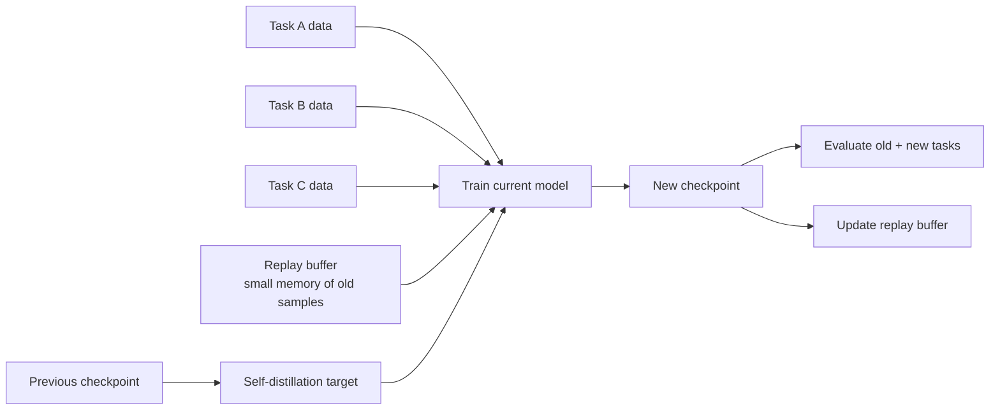
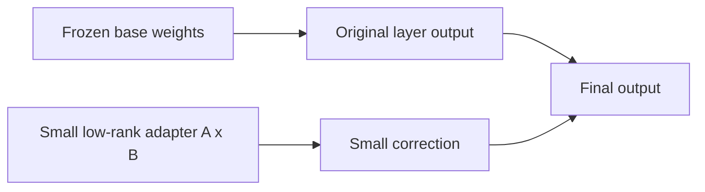
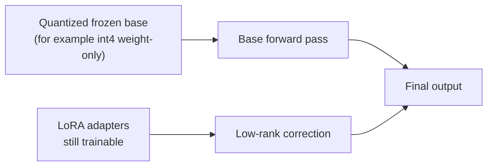

# Continual learning (anti-forgetting) for `rtdetr_pose`

This repo supports **continual fine-tuning** on multiple datasets/tasks while mitigating catastrophic forgetting.

The baseline strategy is:

- **Memoryless**: self-distillation from the previous checkpoint (`--self-distill-from`) so the new model stays close to the old one (SDFT-style objective; reverse-KL on logits by default).
- **Memory**: add a small **replay buffer** (default 50 images, reservoir sampling) and train on *(current task + replay)* while also self-distilling.
- Optional: **LoRA** to restrict trainable parameters (parameter-efficient continual fine-tuning).

## Continual learning in one picture



The plain-language version is:

- new data keeps arriving
- we still want the model to remember older tasks
- so we do not let the new training run completely forget the previous checkpoint
- and we optionally keep a small memory of older examples

## LoRA and QLoRA in plain language

Many readers first meet continual learning and LoRA at the same time, so it helps to separate the ideas.

- **Continual learning** answers: "How do we keep learning new tasks without erasing old ones?"
- **LoRA / QLoRA** answer: "How do we make those updates smaller, cheaper, and easier to control?"

### LoRA in one picture



LoRA is easiest to understand as:

- keep the large pretrained model mostly unchanged
- attach a much smaller trainable correction
- learn that correction instead of rewriting the whole network

That is useful in continual learning because a smaller trainable surface often makes forgetting easier to control.

### What actually gets updated in LoRA

This is the part many readers want spelled out clearly:

- the large base weights are usually frozen
- the trainable update lives in small low-rank matrices attached to selected layers
- the effective weight can be read as:

$$
W' = W + \Delta W,\qquad \Delta W = B A
$$

- `W` is the frozen pretrained weight
- `A` and `B` are the small trainable adapter matrices

So the practical interpretation is:

- the model still uses the old backbone knowledge
- but each adapted layer gets a small learnable correction
- in continual learning, this means the update surface is narrower than full fine-tuning

That is why people often say LoRA is easier to control:

- fewer parameters move
- the old checkpoint remains a stronger anchor
- replay and self-distillation are not replaced; LoRA just changes how the new update is expressed

### QLoRA in one picture



QLoRA keeps the same basic idea as LoRA, but makes the frozen base cheaper to hold in memory.

In this repo, `--qlora` is a convenience path:

- it requires `--lora-r > 0`
- it forces base freezing
- it requests the `torchao` int4 weight-only path when available

So the short intuition is:

- **LoRA**: freeze most of the model, train a small adapter
- **QLoRA**: do the same thing, but keep the frozen base in a cheaper quantized form

Operationally, the update logic is still LoRA-style:

- adapters move
- the frozen base remains the reference
- quantization changes storage/runtime cost, not the anti-forgetting objective

### When each one is attractive

LoRA is a good default when:

- you want a simpler mental model
- you want easier debugging
- you do not need to squeeze memory aggressively

QLoRA is attractive when:

- memory pressure is the main problem
- you already accept an experimental quantized training path
- you want a smaller hardware footprint while keeping adapter-style updates

### A practical choice example

Suppose we are doing domain-incremental training over three warehouse camera domains:

- the base checkpoint already works reasonably well
- we mainly want to avoid forgetting older camera views
- our GPU memory budget is limited, but not extreme

In that case, a good first decision is:

- start with **LoRA**
- keep replay + self-distillation enabled
- get a stable baseline first

Why?

- LoRA is easier to debug
- if forgetting increases, we can more easily tell whether the issue is the continual-learning setup or the adapter size/config
- it removes one layer of quantization-related uncertainty

Now imagine the same workload, but:

- the model barely fits in memory
- batch size is collapsing
- the frozen base dominates the memory footprint

That is the point where **QLoRA** becomes attractive:

- we keep the same adapter-style update logic
- but we ask the frozen base to consume less memory

So a practical rule is:

- **LoRA first when clarity matters**
- **QLoRA when memory is the real blocker**

### Pros / Cons

**LoRA**

Pros:

- easier to reason about than full fine-tuning
- usually cheaper than updating all parameters
- often plays well with replay and self-distillation

Cons:

- still adds another set of knobs (`r`, `alpha`, `dropout`, target modules)
- can underfit if the adapter is too small
- can hide the fact that the base model, not the adapter, is the real bottleneck

**QLoRA**

Pros:

- pushes memory use down further
- keeps the same adapter-style workflow
- useful when the full frozen base is the memory bottleneck

Cons:

- more moving parts than plain LoRA
- depends on quantization backend support
- in practice, this repo treats the quantized path as more experimental than plain LoRA

## References (self-distillation background)

This repo’s checkpoint-based self-distillation is a pragmatic anti-forgetting regularizer; it is not intended as a faithful reproduction of any single paper.

- Knowledge distillation (original): Hinton et al., “Distilling the Knowledge in a Neural Network” (arXiv:1503.02531)
  - https://arxiv.org/abs/1503.02531
- Self-distillation (classic reference): Furlanello et al., “Born Again Neural Networks” (arXiv:1805.04770)
  - https://arxiv.org/abs/1805.04770
- Continual learning via self-distillation: “Self-Distillation Enables Continual Learning” (arXiv:2601.19897)
  - https://arxiv.org/abs/2601.19897?utm_source=chatgpt.com

## 0-minute start (pip users; CPU)

If you want to **see continual-learning behavior** (domain shift + forgetting mitigation) without downloading datasets:

```bash
python3 -m pip install 'yolozu[demo]'
yolozu demo continual --compare --markdown
```

This is a **toy synthetic** demo (not an image model). For real continual fine-tuning on image datasets, use the `rtdetr_pose` workflow below.

## Quick start (domain-incremental)

1) Create a continual config (start from the example):

- `configs/continual/rtdetr_pose_domain_inc_example.yaml`

2) Run continual fine-tuning:

```bash
python3 rtdetr_pose/tools/train_continual.py \
  --config configs/continual/rtdetr_pose_domain_inc_example.yaml
```

To run **memoryless**, set `continual.replay_size: 0` in the config (or pass `--replay-size 0`).

3) Evaluate forgetting (mAP proxy or pose metrics + CL summary metrics):

```bash
python3 tools/eval_continual.py \
  --run-json runs/continual/<run>/continual_run.json \
  --device cpu \
  --max-images 50
```

Pose/depth metrics (requires pose sidecar metadata in `labels/<split>/*.json`):

```bash
python3 tools/eval_continual.py \
  --run-json runs/continual/<run>/continual_run.json \
  --device cpu \
  --max-images 50 \
  --metric pose \
  --metric-key pose_success
```

Pose mode supports these `--metric-key` values:
- `pose_success`, `rot_success`, `trans_success`, `match_rate`, `iou_mean`
- `depth_abs_mean`, `depth_abs_median`
- `add_mean`, `add_median`, `adds_mean`, `adds_median`

Notes:
- `depth_abs_*` requires GT depth (`t_gt`) plus predicted depth/translation fields.
- `add*`/`adds*` require CAD points in sidecar metadata (`cad_points` / `cad_path` / `cad_points_path`) and valid GT+pred pose.

Examples for metric-key switching:

```bash
# depth error summary
python3 tools/eval_continual.py \
  --run-json runs/continual/<run>/continual_run.json \
  --metric pose \
  --metric-key depth_abs_mean

# ADD / ADDS (requires CAD points)
python3 tools/eval_continual.py \
  --run-json runs/continual/<run>/continual_run.json \
  --metric pose \
  --metric-key add_mean

python3 tools/eval_continual.py \
  --run-json runs/continual/<run>/continual_run.json \
  --metric pose \
  --metric-key adds_mean
```

This writes:
- `runs/continual/<run>/continual_eval.json`
- `runs/continual/<run>/continual_eval.html`

4) Decide whether the candidate checkpoint should be promoted:

```bash
python3 tools/continual_decide.py \
  --eval-json runs/continual/<run>/continual_eval.json \
  --run-json runs/continual/<run>/continual_run.json \
  --max-forgetting 0.05 \
  --min-new-task-score 0.40 \
  --min-old-task-final 0.40 \
  --min-reviewed-labels 20 \
  --min-highconf-pseudo-labels 50 \
  --min-total-curated-examples 60
```

This writes:
- `runs/continual/<run>/continual_promotion_decision.json` by default

Decision model:
- `hold`: hard gate failed (for example forgetting too high)
- `review`: hard gates passed, but operator review is still required (for example insufficient curation evidence or `--ttt-active`)
- `promote`: hard gates passed and no soft review gate blocked promotion

Minimal optional `curation_json` shape:

```json
{
  "counts": {
    "samples_total": 1200,
    "candidate_images": 90,
    "reviewed_labels": 48,
    "pseudo_labels_high_confidence": 120
  }
}
```

Operational recommendation:
- use `continual_decide.py` as the automation layer for checkpoint promotion
- keep TTT separate from automatic promotion unless you explicitly opt in with `--allow-ttt-active-promotion`
- treat reviewed labels and trusted pseudo-label counts as soft gates, not as proof of model quality by themselves

## Measured smoke run (what we actually validated)

We ran a tiny two-task continual-learning smoke experiment in this repo to verify that the memoryless SDFT path is really exercised.

Setup:
- source data: a small deterministic slice of `data/coco128`
- Task A: 8 train images + 4 val images
- Task B: 8 train images + 4 val images
- device: `cpu`
- `image_size=160`
- `batch_size=1`
- `max_steps=2`
- replay: disabled (`replay_size: 0`)

We compared:
- naive sequential fine-tune: Task B resumes from Task A without a teacher checkpoint
- memoryless SDFT: Task B resumes from Task A and also receives `--self-distill-from <task_a_checkpoint>`

Observed facts from the measured run:
- the SDFT run recorded `self_distill_from` in `task01_task_b/run_record.json`
- the SDFT run wrote `loss_sdft`, `loss_sdft_bbox`, and `loss_sdft_logits` into `task01_task_b/metrics.json`
- the naive run did not emit those SDFT-specific loss terms

Observed task-B losses in that smoke run:

| Run | Teacher on Task B | Final Task-B loss | Distillation-only terms |
|---|---|---:|---|
| naive | none | `2.673` | none |
| SDFT | Task A checkpoint | `1.975` | `loss_sdft=0.187`, `loss_sdft_bbox=0.057`, `loss_sdft_logits=0.130` |

Important limitation:
- this smoke run used only 2 optimization steps per task and only 4 validation images per task
- the proxy mAP matrix therefore stayed at `0.0` for both runs
- so this example validates the SDFT wiring and emitted artifacts, not a meaningful accuracy gain

## Outputs (train)

`train_continual.py` creates a run folder under `runs/continual/` and writes:

- `continual_run.json` (tasks, checkpoints, config hash, run record)
- `replay_buffer.json` (buffer summary)
- Per-task folders:
  - `checkpoint.pt` (weights-only)
  - `checkpoint_bundle.pt` (optional; if enabled in `train_minimal.py`)
  - `metrics.jsonl/json/csv`
  - `run_record.json`

## Full config schema (code-accurate)

Source of truth: `rtdetr_pose/tools/train_continual.py`.

Validation rules enforced by code:
- `schema_version` defaults to `1`; values other than `1` are rejected.
- `model_config` is required.
- `tasks` must be a non-empty list.
- each task must define `dataset_root`.
- `replay_fraction >= 0`, `replay_per_task_cap >= 0`.

Top-level keys:

| Key | Type | Default | Notes |
|---|---|---|---|
| `schema_version` | int | `1` | only `1` supported |
| `model_config` | str | required | RTDETR pose model JSON path |
| `train` | object | `{}` | forwarded to `train_minimal.py` (snake_case keys) |
| `continual` | object | `{}` | CL-specific options |
| `tasks` | list | required | sequential tasks |

`train` block:
- Keys are forwarded as `--<key-with-dashes>` to `train_minimal.py`.
- `seed`, `dataset_root`, `split` are managed by the runner and removed from forwarded keys.
- Recommended reference for accepted keys/defaults: `docs/training_inference_export.md`.

`continual` block:

| Key | Type | Default | Notes |
|---|---|---|---|
| `seed` | int | `train.seed` or `0` | runner/global seed |
| `replay_size` | int | `50` | `0` disables replay |
| `replay_strategy` | str | `reservoir` | reported in metadata |
| `replay_fraction` | float/null | `null` | replay_k = `round(fraction * train_records)` |
| `replay_per_task_cap` | int/null | `null` | cap replay samples per past task |

`continual.distill` (memoryless baseline):

| Key | Type | Default |
|---|---|---|
| `enabled` | bool | `true` |
| `keys` | str | `logits,bbox` |
| `weight` | float | `1.0` |
| `temperature` | float | `1.0` |
| `kl` | str | `reverse` |

`continual.lora` (optional):

| Key | Type | Default |
|---|---|---|
| `enabled` | bool | `false` |
| `r` | int | `0` (effective when enabled) |
| `alpha` | float/null | `null` |
| `dropout` | float | `0.0` |
| `target` | str | `head` |
| `freeze_base` | bool | `true` |
| `train_bias` | str | `none` |

`QLoRA` is represented by the same LoRA block plus the trainer-side `qlora` convenience flag described in [`docs/quantization.md`](quantization.md). Operationally, that means "LoRA with a quantized frozen base" rather than a separate continual-learning algorithm.

`continual.derpp` (optional):

| Key | Type | Default |
|---|---|---|
| `enabled` | bool | `false` |
| `teacher_key` | str | `derpp_teacher_npz` |
| `keys` | str | `logits,bbox` |
| `weight` | float | `1.0` |
| `temperature` | float | `1.0` |
| `kl` | str | `reverse` |
| `logits_weight` | float | `1.0` |
| `bbox_weight` | float | `1.0` |
| `other_l1_weight` | float | `1.0` |

`continual.ewc` / `continual.si` (optional):

| Key | Type | Default | Notes |
|---|---|---|---|
| `ewc.enabled` | bool | `false` | enables `--ewc` |
| `ewc.lambda` | float | unchanged trainer default (`1.0`) if omitted | passed as `--ewc-lambda` only when present |
| `si.enabled` | bool | `false` | enables `--si` |
| `si.c` | float | unchanged trainer default (`1.0`) if omitted | passed as `--si-c` only when present |
| `si.epsilon` | float | unchanged trainer default (`1e-3`) if omitted | passed as `--si-epsilon` only when present |

`tasks[]` items:

| Key | Type | Default | Notes |
|---|---|---|---|
| `name` | str | `taskXX` | used in output folder naming |
| `dataset_root` | str | required | YOLO-format root |
| `train_split` | str | `train2017` (`split` fallback) | training split |
| `val_split` | str | `val2017` | metadata/eval split tag |

### CLI overrides for the runner

`train_continual.py` runner-only flags:

| Flag | Default | Effect |
|---|---|---|
| `--config` | required | continual YAML/JSON |
| `--run-dir` | auto timestamp dir | output base dir |
| `--replay-size` | `None` | overrides `continual.replay_size` |
| `--replay-fraction` | `None` | overrides `continual.replay_fraction` |
| `--replay-per-task-cap` | `None` | overrides `continual.replay_per_task_cap` |

## Notes / caveats

- The current continual evaluation uses `yolozu.simple_map` (CPU-friendly proxy). For full COCO mAP you can switch your workflow to `tools/eval_coco.py` with `pycocotools` installed.
- `rtdetr_pose` dataset loading scans `*.jpg`, `*.jpeg`, `*.png`, `*.bmp`, `*.tif`, `*.tiff`, `*.webp`, and `*.gif` under `images/<split>/`.

## References (parameter-efficient tuning background)

- LoRA: Hu et al., “LoRA: Low-Rank Adaptation of Large Language Models” (arXiv:2106.09685)
  - https://arxiv.org/abs/2106.09685
- QLoRA: Dettmers et al., “QLoRA: Efficient Finetuning of Quantized LLMs” (arXiv:2305.14314)
  - https://arxiv.org/abs/2305.14314
