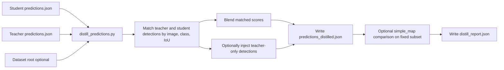

# Prediction distillation helper

YOLOZU includes a lightweight **offline prediction distillation** helper that blends teacher predictions into student predictions and writes both a distilled `predictions.json` artifact and a compact report JSON.

This page is intentionally written as a beginner-facing guide. If you are new to distillation, read it in this order:

1. What this helper is
2. What it is not
3. The step-by-step workflow
4. How to read the output files
5. Guardrails / Pros / Cons

## What this helper is

`tools/distill_predictions.py` is an **artifact-level** helper.
It does not open a training loop and it does not update model weights.
Instead, it rewrites a student `predictions.json` by comparing it with a teacher `predictions.json` and then:

- blends scores for teacher/student predictions that match each other
- optionally injects teacher-only detections that the student missed
- writes a report that records what changed
- optionally evaluates student vs distilled predictions on the same dataset split

This makes it useful for **fast ablations** and for answering questions such as:

- "If I trust the teacher more on this subset, does a simple offline blend help?"
- "Is my teacher providing useful extra detections, or just noise?"
- "Before I build a heavier training-time distillation setup, is there any signal here at all?"

## What this helper is not

This helper is intentionally narrower than training-time distillation or TTT.
It is important not to mix them up.

- It is **not** checkpoint-based self-distillation during training.
- It is **not** an anti-forgetting method by itself.
- It is **not** a replacement for full evaluator-driven reporting.
- It is **not** changing model parameters at test time.

In YOLOZU terms:

- **Prediction distillation**: rewrite one `predictions.json` artifact using another `predictions.json` artifact.
- **Self-distillation / continual learning**: train a new checkpoint while regularizing it toward a previous checkpoint.
- **TTT / CTTA**: adapt model parameters during inference-time operation under domain shift.

If your actual goal is catastrophic-forgetting mitigation, use the continual-learning workflow instead:

- `rtdetr_pose/tools/train_continual.py`
- `rtdetr_pose/tools/train_minimal.py --self-distill-from ...`
- [`docs/continual_learning.md`](continual_learning.md)

If your actual goal is online adaptation under domain shift, use the TTT workflow instead:

- [`docs/ttt_protocol.md`](ttt_protocol.md)

## Distillation in one picture



The key idea is simple:

- keep the student artifact as the base
- only borrow teacher information where the chosen rules allow it
- record the result as a new artifact, instead of mutating the original files

## The step-by-step workflow

### Step 1. Prepare two prediction artifacts

You need:

- one **student** `predictions.json`
- one **teacher** `predictions.json`

Both should already satisfy the predictions interface contract.
If they came from different runtimes or frameworks, validate them first.

```bash
python3 tools/validate_predictions.py reports/predictions_student.json --strict
python3 tools/validate_predictions.py reports/predictions_teacher.json --strict
```

### Step 2. Decide how aggressive you want the blend to be

The helper has two main behaviors:

- **matched blending**
  - when teacher and student predict the same object, their scores are blended
- **missing-detection injection**
  - when the teacher has a detection and the student does not, the helper can add that teacher detection into the output

The main knobs are:

- `--alpha`
  - how much teacher score influences matched detections
- `--iou-threshold`
  - how strictly teacher/student detections must overlap to count as a match
- `--add-missing`
  - whether teacher-only detections may be injected
- `--teacher-min-score`
  - minimum teacher confidence for injection
- `--max-added-per-image`
  - cap on teacher-only additions per image
- `--add-duplicate-iou-threshold`
  - suppresses near-duplicate injections

### Step 3. Run the helper

Minimal conservative example:

```bash
python3 tools/distill_predictions.py \
  --student reports/predictions_student.json \
  --teacher reports/predictions_teacher.json \
  --dataset data/coco128 \
  --split val2017 \
  --alpha 0.5 \
  --iou-threshold 0.7 \
  --output reports/predictions_distilled.json \
  --output-report reports/distill_report.json
```

More exploratory example with teacher-only injection enabled:

```bash
python3 tools/distill_predictions.py \
  --student reports/predictions_student.json \
  --teacher reports/predictions_teacher.json \
  --dataset data/coco128 \
  --split val2017 \
  --alpha 0.5 \
  --iou-threshold 0.7 \
  --add-missing \
  --teacher-min-score 0.25 \
  --max-added-per-image 20 \
  --add-duplicate-iou-threshold 0.9 \
  --output reports/predictions_distilled.json \
  --output-report reports/distill_report.json
```

### Step 4. Read the outputs in the right order

The helper writes two main artifacts:

- `reports/predictions_distilled.json`
- `reports/distill_report.json`

Recommended reading order:

1. `distill_report.json`
2. `predictions_distilled.json`
3. full evaluator output if you are preparing a real report

### Optional: put the knobs in a JSON config

If you do not want to repeat a long flag list, move the distillation settings into a JSON file and pass it with `--config`.

Example:

```json
{
  "enabled": true,
  "iou_threshold": 0.7,
  "alpha": 0.5,
  "add_missing": true,
  "add_score_scale": 0.5,
  "teacher_min_score": 0.25,
  "max_added_per_image": 20,
  "add_duplicate_iou_threshold": 0.9
}
```

Then call:

```bash
python3 tools/distill_predictions.py \
  --student reports/predictions_student.json \
  --teacher reports/predictions_teacher.json \
  --dataset data/coco128 \
  --split val2017 \
  --config configs/examples/distill_predictions.json \
  --output reports/predictions_distilled.json \
  --output-report reports/distill_report.json
```

## How the algorithm behaves

### A. Matched detections

For each image, teacher and student detections are compared.
When they overlap enough under `--iou-threshold`, the helper treats them as corresponding detections.
In that case it blends the score using `--alpha`.

Intuition:

- lower `alpha`: trust the student more
- higher `alpha`: trust the teacher more

This is the safer part of the workflow because both artifacts already agree that there is probably an object there.

### B. Teacher-only detections

If `--add-missing` is enabled, the helper may inject detections that appear in the teacher artifact but not in the student artifact.
This is where most gains and most risks come from.

Possible upside:

- recover missed objects
- expose useful teacher signal quickly

Possible downside:

- propagate teacher false positives
- produce duplicate boxes if guardrails are too loose
- make a weak student artifact look better on a tiny subset while hurting general behavior elsewhere

That is why the safety knobs matter so much.

## How to read `distill_report.json`

The report is intentionally small, but it is enough for first-pass interpretation.

Typical fields to inspect:

- `losses.distill_score_gap`
  - average score gap recorded during matched blending
- `metrics.student.map50`
- `metrics.student.map50_95`
- `metrics.distilled.map50`
- `metrics.distilled.map50_95`
- `meta.matched`
  - number of teacher/student matches used for blending
- `meta.added`
  - number of teacher-only detections injected
- `meta.distill.*`
  - the exact distillation parameters used

Interpretation pattern:

- **`matched` high, `added` low**
  - the helper mostly refined confidence on objects both models already found
- **`added` high**
  - the run depended heavily on teacher-only injection
- **metrics up, `added` low**
  - usually a healthier sign
- **metrics up, `added` very high**
  - often worth rechecking for duplicate or noisy teacher propagation

## Recommended recipes

### Conservative recipe

Use this first when you want a stable sanity check.

```bash
python3 tools/distill_predictions.py \
  --student reports/predictions_student.json \
  --teacher reports/predictions_teacher.json \
  --dataset data/coco128 \
  --split val2017 \
  --alpha 0.3 \
  --iou-threshold 0.7 \
  --teacher-min-score 0.3 \
  --output reports/predictions_distilled.json \
  --output-report reports/distill_report.json
```

Why use it:

- low risk of injecting teacher noise
- good first answer to "is there any useful signal here?"

### Exploratory ablation recipe

Use this when you want to test whether teacher-only objects help.

```bash
python3 tools/distill_predictions.py \
  --student reports/predictions_student.json \
  --teacher reports/predictions_teacher.json \
  --dataset data/coco128 \
  --split val2017 \
  --alpha 0.5 \
  --iou-threshold 0.7 \
  --add-missing \
  --teacher-min-score 0.25 \
  --max-added-per-image 20 \
  --add-duplicate-iou-threshold 0.9 \
  --output reports/predictions_distilled.json \
  --output-report reports/distill_report.json
```

Why use it:

- good for fast research iteration
- useful before investing in a training-time teacher-student pipeline

### Reporting recipe

If the result looks promising, do **not** stop at the lightweight proxy.
Follow up with the full evaluator you would normally trust for the task.

## Pros / Cons

## Pros

- Very fast to run on CPU.
- No retraining required.
- Preserves the predictions interface contract workflow.
- Good for teacher-student ablations and quick feasibility checks.
- Easy to compare with and without distillation because both are ordinary artifacts.

## Cons

- It is still a post-hoc artifact rewrite, not real model learning.
- Strong gains can be fragile if they come mostly from teacher-only injection.
- Small fixed subsets can overstate benefit.
- It does not solve catastrophic forgetting.
- It does not guarantee safer deployment behavior.

## Practical guardrails

Recommended safety defaults:

- `teacher_min_score >= 0.2`
- finite `--max-added-per-image`
- high `add_duplicate_iou_threshold` such as `0.85` to `0.95`
- always specify `--split` when dataset roots contain multiple candidate splits
- treat the lightweight `simple_map` proxy as a quick signal, not the final claim

## When to use prediction distillation vs TTT vs self-distillation

| Goal | Recommended workflow |
|---|---|
| Quick offline teacher/student ablation | Prediction distillation |
| Adapt at inference time under domain shift | TTT / CTTA |
| Mitigate forgetting while training across tasks/domains | Continual learning with self-distillation / replay / PEFT |
| Generate a new checkpoint that actually learns teacher behavior | Training-time distillation |

## References and background

This helper is an artifact-level utility, not a claim of faithful reproduction of a single paper.
Still, the conceptual background comes from the broader distillation literature:

- Hinton et al., *Distilling the Knowledge in a Neural Network* (2015)
- Furlanello et al., *Born Again Neural Networks* (2018)

In YOLOZU, the important distinction is:

- **prediction distillation** here = offline artifact blending
- **self-distillation** in continual learning = training-time regularization against a prior checkpoint

For continual-learning references, see [`docs/continual_learning.md`](continual_learning.md).
